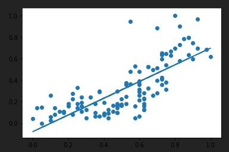

# Linear Regression_Simple Linear Regression

> 결과값 y를 결정하는 독립변수 x가 1개인 단순선형회귀모형


## 1. 머신러닝 구현


 **머신러닝**은, 경향성 있는 data set을 통해 해당 데이터들을 설명하는 **가장 적합한 가설, 모델을 찾는**(가설을 만들어내는) 과정이다. 

cost function의 값이 0에 가까울수록 좋은 `W`, `b`값을 얻을 수 있음.


### 1.1. 필요한 module 불러오기

```python
import tensorflow as tf
```

### 1.2. 학습 data

```python
x_data = [1,2,3]
y_data = [1,2,3]
```

### 1.3. placeholder

* tensorflow 그래프에 입력을 주기 위한 파라미터 기능

``` python
x = tf.placeholder(dtype = tf.float32)
y = tf.placeholder(dtype = tf.float32)
```

### 1.4. Weight, Bias 설정

* Variable 함수 이용

```python
W = tf.Variable(tf.random_normal([1]), name = "weight")		# 기울기
b = tf.Variable(tf.random_normal([1]), name = "bias")		# 절편
# numpy의 ndarray로 random하게 설정.
# [1] : 변수 1개 뽑아낸다는 의미.
```

### 1.5. Hypothesis 설정

* 결국은 가설을 설정하고 그래프를 만드는 과정

```python
H = W*x + b
```

### 1.6. Cost Function

> 비용함수 `node` 만들기

* 최소제곱법을 이용해 비용함수를 프로그램적으로 정의.
* `reduce_mean` : 가설(`H`)에서  관찰값(`y`값)을 빼고, 그 값의 제곱을 합해서 평균을 구함.

```python
cost = tf.reduce_mean(tf.square(H-y))

# 이 식 자체가 최소제곱법을 나타냄.
# cost라는 node가 생김.
# cost를 구하기 위해 H(X, W, b 연결)와 y가 작동되면서 모든 node가 동작하게 됨.
```

### 1.7. Train Node

| Gradient Descent Algorithm                                   |
| ------------------------------------------------------------ |
| 미분을 1번 하면, 특정 `w`값에서 0과 가까워지는 방향으로 `w`가 이동함. |
| `w`가 이동하면서 cost의 최솟값이 되는 `w`까지 이동.          |
| learning rate : 기울기를 변화시켜 나가는 정도                |

* `optimizer`변수에  gradient descent algorithm을 구하는 함수 저장.
* gradient descent를 이용해 찾은 최적화 경로 상에서 어느 정도 크기로 이동할 것인지 `learning rate`인자로서 지정.
  * learning rate에 대해 정해진 값은 없고, 머신러닝을 통해 경험적으로 알아내야 함.
* `train` : 학습의 한 단계로, 인자로 `cost`를 가짐.
  * `cost`를 줄여가면서 이동시켜 학습하겠다는 의미.

```python
optimizer = tf.train.GradientDescentOptimizer(learning_rate = 0.01)		# learning rate는 미정.
train = optimizer.minimize(cost)
# gradient descent algorithm을 통해 cost를 줄여나가는 학습의 과정.

# optimizer, train 모두 node
```

### 1.8. 그래프 실행

* 저장된 `node`를 그래프로 실행하기 위해 `runner(session)` 이 필요함.
  * `session` 만들고, `session`을 이용해서 `run`(실행).
* `Variable` 사용 시 학습하기 전 반드시 **초기화**해야 함.

```python
sess = tf.Session()		# 그래프 실행을 위한 runner node
sess.run(tf.global_variables_initializer())		# 초기화 작업.
```

### 1.9. 학습(learning)

* `train` 실행 시 `optimizer` 통해 `cost`작아지며, `cost`가 최소가 되는 `w`를 찾는 과정.
* 머신러닝 원리 : cost가 최소가 되는 `W`, `b`를 찾아서 데이터를 설명하는 최적의 model을 설정함.
  * `for`문 사용 : `train`을 여러 번 함으로써 cost를 계속해서 줄여나가야 함. 
  * cost가 0과 근접할 때까지 cost 값을 줄여 나가야 하는데, 학습의 횟수에 관계없이 cost가 0에 가까워질 지는 알 수 없음.
  * 학습을 많이 할수록 정확해지지만, 소요 시간이 길어짐.
  * 학습 데이터의 size, 전체적 학습 시간을 고려해서 몇 번 반복할지 그 횟수를 결정해야 함.

```python
for step in range(3000):     										# 총 3000번 반복
    _, cost_val, W_val, b_val = sess.run([train, cost, W, b],
                                         feed_dict = {x : x_data,
                                                      y : y_data})
    
    # 3000번 실행되면서 cost 값이 변하고, 내부적으로 random으로 설정한 W, b가 최적값으로 변해 감.
    # sess.run(train) : train 실행되기는 하지만, 진짜 w, b, cost 값이 변하는지 확인할 수 없음.
    # train은 단순히 연결해주는 node일 뿐이고, 실제 값을 가지고 있지 않음.
    # 따라서 W, b, cost가 변하는지 확인하기 위해 각 값에 대해 변수 할당.
    # underscore('_') : 관용적으로 아무 것도 할당하지 않는다는 의미.
  
 if step % 300 == 0:            # 학습 횟수가 300의 배수가 될 때마다, 값들을 한 번씩 찍어보겠다!
        print("cost 값 : {}, b값: {}, W값: {}".format(cost_val, b_val, W_val))
```

```python
(실행 결과)
cost 값 : 16.48314094543457, b값: [1.3681263], W값: [-1.2474538]
cost 값 : 0.13262701034545898, b값: [0.9592041], W값: [0.5780445]
cost 값 : 0.03129461407661438, b값: [0.46593982], W값: [0.79503226]
cost 값 : 0.007384259253740311, b값: [0.2263333], W값: [0.90043557]
cost 값 : 0.0017423788085579872, b값: [0.10994277], W값: [0.951636]
cost 값 : 0.0004111312737222761, b값: [0.05340539], W값: [0.9765069]
cost 값 : 9.701101953396574e-05, b값: [0.02594212], W값: [0.988588]
cost 값 : 2.2890593754709698e-05, b값: [0.01260155], W값: [0.9944565]
cost 값 : 5.400966983870603e-06, b값: [0.00612122], W값: [0.99730724]
cost 값 : 1.2746194215651485e-06, b값: [0.00297354], W값: [0.9986919]
            
" y = x " 에 가까워져야 하므로, 학습을 진행할수록 w는 1에, b는 0에, cost는 0에 가까워져야 함.
```

### 1.10. 예측

* 예측: 학습이 완료(=최적의 `W`와 `b`를 찾아 가설 `H`를 설정함)되면, 새로운 데이터를 입력하여 가설을 실행하고, 결과값을 예측함.

```python
sess.run(H, feed_dict = {x:200})			# 가설(H)을 실행하는데, x에 200을 넣어라.
print(sess.run(H, feed_dict = {x:200}))
```

```python
(실행 결과)
[199.97406]			# x에 200 넣었을 때의 예측값.
```


## 2. 실습

> `ozone.csv` 파일을 통해 온도와 오존량의 관계 파악.
>
> * 전처리 : 날짜별로 측정한 raw data이므로 EDA 필요.
> * 머신러닝 : 데이터 형태 파악 후, 적합한 모델 설정.
> * 예측


## 2.1. 필요한 모듈 불러오기

```python
import tensorflow as tf									
import numpy as np								# pandas 모듈은 내부적으로 numpy 이용.
import pandas as pd								# csv 파일 읽고, data frame으로 EDA.
import matplotlib.pyplot as plt					# 데이터 경향성 확인(산점도), 가설(직선).
```


## 2.2. 학습 데이터 확보

### 2.2.1. Data Loading

```python
df = pd.read_csv("dir")
df.head()												# 잘 불러왔는지 확인.
print("읽어들인 데이터의 shape : {}".format(df.shape))	   # dataframe 구조 확인.
display(df)
```


### 2.2.2. EDA

#### 1) 결측값 처리

* 결측값을 제거할 것인지, 바꿀 것인지 고민해야 함.
* 결측값 중에서도 ozone, temp에 있는 것만 날려야 하므로, 필요한 column만 뽑아서 저장해야 함.
* `dropna()`를 이용하여 결측값 지우기

```python
# fancy indexing 통해 필요한 column만 뽑아 저장.
df = df[["Ozone", "Temp"]]
# 결측값 제거
df = df.dropna(how = "any", inplace = False)
# how : any -> 어떤 것이라도 다 지움.
# inplace = False -> 원본 바꾸지 않음.
display(df)
print("결측치를 제거한후 남은 데이터의 shape : {}".format(df.shape))
# 결측치 지웠더니 데이터 40개 넘게 날아감. 1/4 가량이 날아가므로, 실제로는 지우면 문제될 수 있음.
```


#### 2) 이상치 처리

* 이상치 확인 : 각 column에 대해 boxplot 그리기

```python
plt.boxplot(df["Temp"])		 # 이상치 없음.
plt.boxplot(df["Ozone"])	 # 이상치 있음.
```


* 이상치 제거 : Turkey Fence 방식
  * IQR 이용해서 이상치 찾아내고 지워야 함.
    * IQR = 3사분위값 - 1사분위값
    * 상위 이상치 = (3사분위값 + 1.5 * IQR)을 초과하는 값.
    * 하위 이상치 = (1사분위값 - 1.5 * IQR) 미만의 값.
  * 수치 계산이 필요하므로, `numpy` 모듈 이용.

```python
q1 = np.percentile(df["Ozone"], 25)				# 1사분위값
q1, q3 = np.percentile(df["Ozone"],[25, 75])	# 한 번에 구하고 싶으면 배열 형태로 구하기.
iqr = q3 - q1
upper = q3 + iqr * 1.5 				# 상위 기준값
# boxplot에 상위 이상치만 존재하므로 upper만 구해도 됨.
mask = df["Ozone"] > upper			#mask
# df["Ozone"] > upper : boolean indexing의 mask 역할
df.loc[mask]						# 이상치를 구함.
df = df.loc[~mask]					# 이상치를 제외한 data frame
display(df)
print("이상치까지 제거한 후 남은 데이터 : {}".format(df.shape))
```


#### 3) 데이터 경향성 확인

* 머신러닝 학습을 진행하기 전에 확보한 데이터가 **선형인지 확인**해야 함.
* **산점도** : 선형성을 확인하기 위해 `matplotlib`의 `scatter` 그래프 활용하여 데이터의 분포(흩어진 정도, 경향 등)를 확인함.


> 확인 결과 전반적으로 선형이므로 학습 가능.

### 2.2.3. Scale 변환

* 데이터의 범위, 수의 크기로 인해 적절한 학습이 이루어지지 않을 수 있음.
* 데이터의 scale을 변환함으로써 학습에 적합한 데이터를 완성해야 함.

#### 1) 변환 방식

* 정규화(normalization) : 0과 1 사이의 값으로 변환

$$
\frac{각 요소의 값 - 최솟값}{최댓값-최솟값}
$$


* 표준화(standardization) : -1과 1 사이의 값으로 변환

$$
\frac{각요소의값-평균}{표준편차}
$$

#### 2) 데이터 좌표계 변환

> 데이터의 범위가 너무 크다면 학습이 제대로 이루어지지 않는다.
>
> 정규화 혹은 표준화의 과정을 통해 데이터의 좌표계를 0과 1 사이 혹은 절댓값 0과 절댓값 1 사이로 변환하는 과정을 거쳐야 학습이 진행된다.
>
> 현재 예제에서는 데이터를 정규화한다.

* 변수를 0과 1 사이의 값으로 정규화한 새로운 column을 생성.

```python
df["Temp_Norm"] = (df["Temp"]-df["Temp"].min())/(df["Temp"].max()-df["Temp"].min())
df["Ozone_Norm"] = (df["Ozone"]-df["Ozone"].min())/(df["Ozone"].max()

                                                    # broadcasting되면서 series가 생성된다.
```


* 정규화 후, 산점도를 그려서 범위가 제대로 줄어들었는지 확인.
  * 왼쪽은 정규화된 좌표계, 오른쪽은 원래 좌표계.

```python
plt.scatter(df["Temp"],df["Ozone"])
plt.scatter(df["Temp_Norm"],df["Ozone_Norm"])
```


## 2.3. 머신러닝 : 학습 및 예측

> 전처리, 좌표계 변환이 완료된 데이터를 통해 
>
> 데이터를 **학습**시키고
>
> 새로운 

### 2.3.1. 학습 데이터 설정(training data)

```python
x_data = df["Temp_Norm"]		# x축 변수
y_data = df["Ozone_Norm"]		# y축 변수
```

### 2.3.2. Placeholder 설정

* 입력 parameter 역할 : data를 받아들임.
  * training data를 받아들여 학습.
  * 입력값을 받아서 예측.

```python
x = tf.placeholder(dtype = tf.float32)
y = tf.placeholder(dtype = tf.float32)
```

### 2.3.3. Weight, Bias 설정

```python
W = tf.Variable(tf.random_normal([1]), name = "weight")  # 1차원, 값 1개만 생성.
b = tf.Variable(tf.random_normal([1]), name = "bias")
```

### 2.3.4. Hypothesis 설정

* 1차원 직선 형태의 가설을 설정.

```python
H = W * x + b
```

### 2.3.5. Cost Function 설정

* 학습을 통해 최소화해야 할 비용함수 설정.

```python
cost = tf.reduce_mean(tf.square(H-y))
# H-y : 가설에서 데이터 y를 빼고,
# square : 그것을 제곱합한 후,
# reduce_mean : 최소화한다.
```

### 2.3.6. train 설정

* 학습에 사용할 알고리즘 node 설정.
* 학습을 진행할 node 설정.

```python
optimizer = tf.train.GradientDescentOptimizer(learning_rate = 0.0001)
# 경사하강법 알고리즘을 실행하는 optimizer node
train = optimizer.minimize(cost)
# 경사하강법 알고리즘을 통해 cost를 최소화하는 train node.
# 한 번 실행할 때 한 번 최소화.
```

### 2.3.7. session 설정, 초기화 작업

* session : node, 머신러닝 학습 등을 진행하는 실행환경
* 학습 진행 전, 반드시 모든 변수를 **초기화**해야 함.

```python
sess = tf.Session()  # session을 켠다.
sess.run(tf.global_variables_initializer())
```

### 2.3.8. 학습

* 여러 번 train node를 반복하여 실행함으로써 학습시킴.

```python
for step in range(30000):
    _, cost_val = sess.run([train, cost], feed_dict = {x : x_data,
                                                      y : y_data})
    if step % 300 == 0:
        print("cost값은 : {}".format(cost_val))
```

```python
(실행 결과)
cost값은 : 1.2462890148162842
cost값은 : 0.026449721306562424
cost값은 : 0.026141811162233353
cost값은 : 0.026140287518501282
cost값은 : 0.026140280067920685
cost값은 : 0.026140278205275536
cost값은 : 0.026140278205275536
cost값은 : 0.026140278205275536
cost값은 : 0.026140278205275536
cost값은 : 0.026140278205275536
```

* 학습을 종료한 후, 산점도와 line graph를 그려봄으로써 데이터와 가설의 분포 확인.

```python
# scatter : 데이터의 분포 확인
plt.scatter(df["Temp_Norm"], df["Ozone_Norm"])
# plot : line graph 그림
# W, b 실행하기 위해서는 session을 실행하는 과정이 필요함.
plt.plot(df["Temp_Norm"], df["Temp_Norm"] * sess.run(W) + sess.run(b))
```




### 2.3.9. 예측

* 좌표계 변환(정규화 혹은 표준화)을 진행했으므로, 예측 시에도 동일한 작업 진행해야 함.

  * 좌표계 변환을 하지 않고 그냥 대입하면 틀린 예측.
  * x값에 대해서도 좌표계를 변환하고, 그로부터 얻은 y값도 좌표계를 변환해야 올바른 예측.

  

  `만약, 화씨 62도에서의 오존량을 예측하고 싶다면?`

```python
(잘못된 예측)
print(sess.run(H, feed_dict = {x : 62}))
# 좌표계가 변환되어 모든 변수가 0과 1 사이인데,
# x에 62를 넣으면 안 됨.

(실행 결과)
[47.97988]
# 잘못된 예측값
```

```python
(올바른 예측)

# 1. 예측값으로 사용할 x값을 정규화하기
tmp = (62 - df["Temp"].min())/(df["Temp"].max()-df["Temp"].min())
print(sess.run(H, feed_dict = {x : tmp}))

(실행 결과)
[0.01807752] # 정규화된 좌표계에서의 x값

# 2. 정규화된 x값을 넣어서 예측값 구하기
result_norm = sess.run(H, feed_dict = {x : tmp})	# 정규화된 x값(tmp)를 넣어서 예측
result = result_norm * (df["Ozone"].max()-df["Ozone"].min()) + df["Ozone"].min()
print(result)	# ozone의 정규화식을 변형해 원래 값 구하기

(실행 결과)
[4.018946] # 제대로 예측해서 구한 y값
```

## 2.4. Scipy 모듈을 통한 구현

> 과학적 연산을 쉽게 할 수 있도록 만들어진 `Scipy` 모듈을 통해 선형회귀를 진행하고, 결과값만 도출한다.

### 2.4.1. 필요한 모듈 불러오기

#### 1) scipy 모듈 설치

* 명령어 : `pip install scipy`


#### 2) 모듈 불러오기

```python
from scipy import stats
import tensorflow as tf
import numpy as np
import pandas as pd
import matplotlib.pyplot as plt
```

### 2.4.2. Data Loading

```python
df = pd.read_csv("C:/Users/student/Desktop/data/ozone.csv")
display(df)       # 잘 불러왔는지 확인.
```

### 2.4.3. EDA

> 불러온 데이터를 학습에 적합한 형태로 만들기 위해 전처리 작업을 진행한다.

#### 1) 필요한 column 추출

* 학습에 필요하지 않은 변수를 날리는 게 우선.

```python
df = df[["Ozone", "Temp"]]  # fancy indexing으로 필요한 column 추출.
df.head()                   # 필요한 column 추출되었는지 확인.
df.shape                    # (153행, 2열)

```

#### 2) 결측치 처리

```python
df = df.dropna(how = "any", inplace = False)   # 결측치 제거 -> 약 40개 가까이 날아감.
df.shape                                       # (116행, 2열)                         

```

#### 3) 이상치 처리

* 이상치 처리하는 여러 방식 중 `Turkey Fence` 방식 활용 : IQR 기반.
* 이상치 존재한다면, 학습 시 내부적으로 이상치에 가중치를 부여하기 때문에 학습이 제대로 진행되지 않음.

```python
# 이상치 있는지 확인
plt.boxplot(df["Temp"])   # 온도에 대해서는 이상치 없음.
plt.boxplot(df["Ozone"])  # 오존에 대해서는 상위 이상치 존재함.

# 이상치 제거
# 오존 변수에 존재하는 상위 이상치를 처리해야 함.
# IQR 이용해 상위, 하위 이상치의 경계값 계산.
q1, q3 = np.percentile(df["Ozone"], [25,75]) # ozone 변수에서 2개의 percentile값 추출.
print(q1, q3)                                # tuple로 1사분위, 3사분위값 반환.
iqr = q3 - q1                                               
upper = q3 + 1.5 * iqr         # 상위이상치 boundary 공식
print(upper)                   # 131.125 : 상위 이상치 처리 위한 경계값.
mask = df["Ozone"] > upper     # 상위 경계값 초과하는 값 찾음.
# broadcasting 진행되며 boolean mask가 생성됨.
df = df.loc[~mask]             # 행 추출: loc 
df.shape                       # (114g행 2열) : 이상치 2개 처리함.

```

#### 4) 데이터 경향성 확인

```python
plt.scatter(df["Temp"], df["Ozone"])
```

#### 

### 2.4.4. 머신러닝 

* `scipy` 패키지의 `stats`모듈을 이용해 선형회귀 및 머신러닝을 쉽게 진행할 수 있음.
* 이 모듈을 활용할 때에도 **전처리 작업은 필요함.**
* **정규화 및 표준화는 모듈 내에서 진행함. **

#### 1) 학습

```python
from scipy import stats

x = df["Temp"]
y = df["Ozone"]

result = stats.linregress(x, y)
print(result)                       # slope : 위에서 구한 W, intercept : 위에서 구한 b.

(실행 결과)
LinregressResult(slope=2.344807849550286, intercept=-142.19084219133276, rvalue=0.7515377011359844, pvalue=5.802324426210489e-22, stderr=0.19448560867502498)
```

#### 2) 예측

* 실제로 선형회귀식에 결과값 대입하여 예측 진행.

```python
print(80*result[0] + result[1])     # result[0] = slope, result[1] = intercept(bias)

(실행 결과)
45.39378577269011
```


