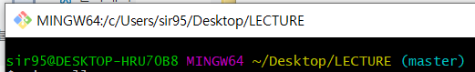

# Git 기초


Git은 **분산형 버전 관리 시스템(DVCS)** 이다. 소스코드의 이력을 확인하고, 협업 단계에서 활용할 수 있다.


## 1. 기본 설정

### 설치 및 author 설정


 윈도우에서 git을 활용하기 위해서는 가 필요하다. [설치링크](https://gitforwindows.org/)


 bash를 설치한 후, `commit`을 작성하는 `author` 를 설정한다.

``` bash
$ git config --global user.name 'sirzzang'
$ git config --global user.email 'sirzzang@naver.com'
```


 설정 내용을 확인하기 위해서는 아래의 명령어를 입력한다.

```bash
$ git config --global -l

(실행 결과)
user.email=sirzzang@naver.com
user.name=sirzzang
```


### gitignore


`commit`을 할 때, 이력을 추적할 필요가 없는 파일이 존재한다.

*예) 환경, jupyter notebook 체크포인트 등 임시로 사용하거나 결과물로 생성되는 파일들*  


 프로젝트를 진행하며 `git`으로 관리하지 않을 파일, 폴더 등을 설정하고 commit 시 배제할 수 있다.

```bash
*.xlsx              # 확장자가 xlsx인 파일
a.txt               # a.txt 파일
.ipynb_checkpoints/ # .ipynb_chackpoints 폴더
```


 프로젝트 시작 시 어떠한 내용을 무시해야 할지 모르겠다면, [gitignore](https://gitignore.io)에서 검색하고 파일을 생성한다.

<right> *예) python, R, jupyter notebook* </right>


## 2. local 저장소에서 활용하기


### git 저장소 설정


특정 프로젝트 폴더에서 `git`을 활용하기 위해서는, 아래의 명령어를 입력한다.

```bash
$ git init

(실행 결과)
Initialized empty Git repository in C:/Users/student/Desktop/git_practice/.git/
```


  bash 창에  `(master)`라는 브랜치 정보가 표기된다.



  이후 해당 directory 내에 `.git`이라는 숨김 폴더가 생성되며, 모든 `git`과 관련된 동작은 해당 폴더에 기록된다.


### add

`git`에서 커밋할 대상 파일을 `staging area`로 이동시키는 명령어이다.

```bash
$ git add a.txt # 특정 파일을 stage하는 명령어.
$ git add images/ # 특정 폴더를 stage하는 명령어.
$ git add . # 모든 디렉토리 파일 및 폴더를 stage
```


* add 전

```bash
$ git status
On branch master

No commits yet

Untracked files: # git 이력에 담기지 않은 파일들
  (use "git add <file>..." to include in what will be committed)
  # git add 명령어를 통해서 커밋될 곳에 추가 해라.
        a.txt
        b.txt

nothing added to commit but untracked files present (use "git add" to track)
```


* add 

```bash
student@M16046 MINGW64 ~/Desktop/git_practice (master)
$ git add a.txt
```


* add 후

```bash


student@M16046 MINGW64 ~/Desktop/git_practice (master)
$ git status
On branch master

No commits yet

Changes to be committed: # commit될 변경 사항.
  (use "git rm --cached <file>..." to unstage)
        new file:   a.txt # a.txt 신규 파일 생성.

Untracked files: # 아직도 track되고 있지 않은 파일들.
  (use "git add <file>..." to include in what will be committed)
        b.txt
```


**항상 "`git status`" 명령어를 통해 현재 상태를 확인하는 것이 중요하다!!!!**


### commit


 위에서 파일을 추가했지만, `No commits yet`이라고 써 있는 문구를 봤을 것이다.

 `commit`은 git에 이력을 남기는 작업이다. `commit`을 남길 때에는 항상 `commit` 메시지를 작성한다. 메시지는 해당 이력에 대한 정보를 담는다. 협업 시 매우 중요하므로, 자세하게 작성한다.

``` bash
$ git commit -m '커밋메시지'
[master (root-commit) 31f694c] Add files
 2 files changed, 0 insertions(+), 0 deletions(-)
 create mode 100644 a.txt
 create mode 100644 b.txt
```


`git` commit 이력을 확인하기 위해서는 아래의 명령을 활용한다.

```bash
$ git log

(실행 결과)
student@M16046 MINGW64 ~/Desktop/git_practice (master)
commit c89784f959b630b2653975717732110da7660766 (HEAD -> master)
Author: sirzzang <sirzzang@naver.com>
Date:   Mon Dec 9 14:26:37 2019 +0900

    git 기초 정리함

commit ad3116b44169f8f44fcdcf4bd35241f954b1f1a7
Author: sirzzang <sirzzang@naver.com>
Date:   Mon Dec 9 14:26:02 2019 +0900

    git 기초 정리

student@M16046 MINGW64 ~/Desktop/git_practice (master)
$ git status
On branch master
nothing to commit, working tree clean # commit할 것 없으면 clean이라고 나옴.

```


이후 변경 사항이 발생하게 된다면, `add` 후 `commit`을 진행한다.

* `add` : commit할 대상 파일 선정.
* `commit` : 이력의 확정.


## 2. 원격 저장소(remote repository) 활용하기


 git 원격 저장소를 제공하는 서비스가 있다. 그 중 가장 유명하고 널리 사용되는 GitHub를 사용한다.


### 기본 설정

* Github에 비어 있는 저장소(repository)를 생성한다.

* 원격 저장소를 설정할 local 저장소에서 다음의 명령어를 입력한다.

```bash
$ git remote add origin https://~

(의미)
원격 저장소(`remote`)를 `origin`이라는 이름으로 url(`https://~`)로 설정한다.

(실행 결과)
student@M16046 MINGW64 ~/Desktop/git_practice (master)
$ git remote add origin https://github.com/sirzzang/TIL
```


* 아래의 명령어를 통해 저장된 원격 저장소의 목록을 확인할 수 있다.

```bash
$ git remote -v

(실행 결과)
student@M16046 MINGW64 ~/Desktop/git_practice *
origin  https://github.com/sirzzang/TIL (fetch)
origin  https://github.com/sirzzang/TIL (push)
```


* 원격 저장소와 local 저장소가 잘못 설정되었다면 아래의 명령어를 통해 저장소 연결을 삭제할 수 있다.

```bash
$ git remote rm origin
$ git remote -v

(실행 결과)
student@M16046 MINGW64 ~/Desktop/git_practice (master)
$ git remote rm origin
```


### commit & push


 `origin`으로 설정된 원격 저장소에 `push`하고 이력을 남기면 된다.


 원격 저장소에 폴더와 파일을 업로드하기 위해서는 `push` 명령어를 사용한다.

* add 후 status 확인

```bash
student@M16046 MINGW64 ~/Desktop/TIL (master)
$ git add .

student@M16046 MINGW64 ~/Desktop/TIL (master)
$ git commit -m 'git 원격 저장소 연습'
[master 9765193] git 원격 저장소 연습
 1 file changed, 267 insertions(+)
 create mode 100644 "Git \352\270\260\354\264\210.md"

student@M16046 MINGW64 ~/Desktop/TIL (master)
$ git status
On branch master
Your branch is ahead of 'origin/master' by 1 commit.
  (use "git push" to publish your local commits)

nothing to commit, working tree clean
```


* 이후 `origin`으로 설정된 원격 저장소에 push한다. 

```bash
$ git push origin master

(실행 결과)
Enumerating objects: 3, done.
Counting objects: 100% (3/3), done.
Delta compression using up to 8 threads
Compressing objects: 100% (2/2), done.
Writing objects: 100% (3/3), 210 bytes | 210.00 KiB/s, done.
Total 3 (delta 0), reused 0 (delta 0)
To https://github.com/edutak/gittest.git
 * [new branch]      master -> master
```


* 이후에 변경된 사항(`commit`)이 발생했을 때, **`git push origin master`** 명령어를 통해 매번 업로드한다.

