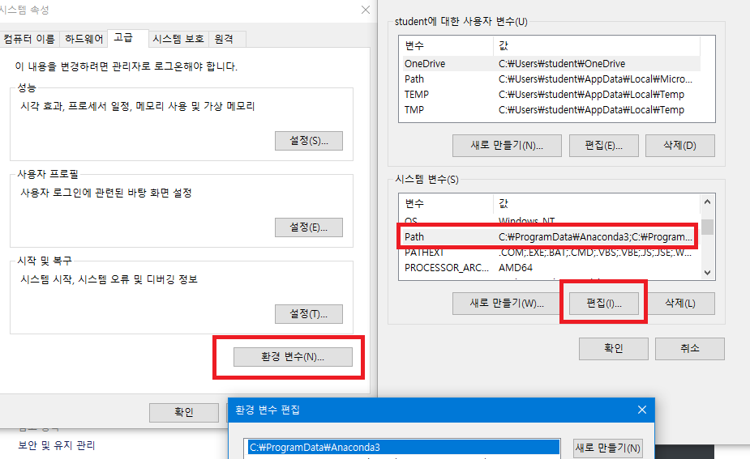

# SQL

## 0. 준비 사항

* [MariaDB](https://mariadb.com/download-confirmation/?group-name=MariaDB%20Community%20Server&release-notes-uri=https%3A%2F%2Fmariadb.com%2Fkb%2Fen%2Fmariadb-10232-release-notes%2F&documentation-uri=https%3A%2F%2Fmariadb.com%2Fkb%2Fen%2Fwhat-is-mariadb-102%2F&download-uri=https%3A%2F%2Fdownloads.mariadb.com%2FMariaDB%2Fmariadb-10.2.32%2Fwinx64-packages%2Fmariadb-10.2.32-winx64.msi&product-name=MariaDB%2520Server&download-size=55.67%20MB) 설치 : 10.2.32

* 환경변수 등록

  * 내 PC - 우클릭 - 속성 - 고급 시스템 설정

    

  * 환경변수 편집 탭에서 mariaDB bin 폴더 경로 추가

    

    

로컬호스트 : 루프백 아이피. 내 자신의 PC를 지칭하는 IP.

* 환경변수 설정 완료 후 cmd 창에서 `mysql

heidi

## 1. 