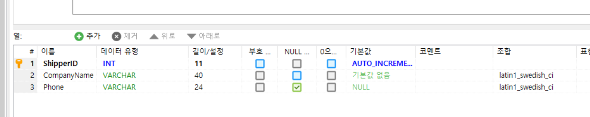
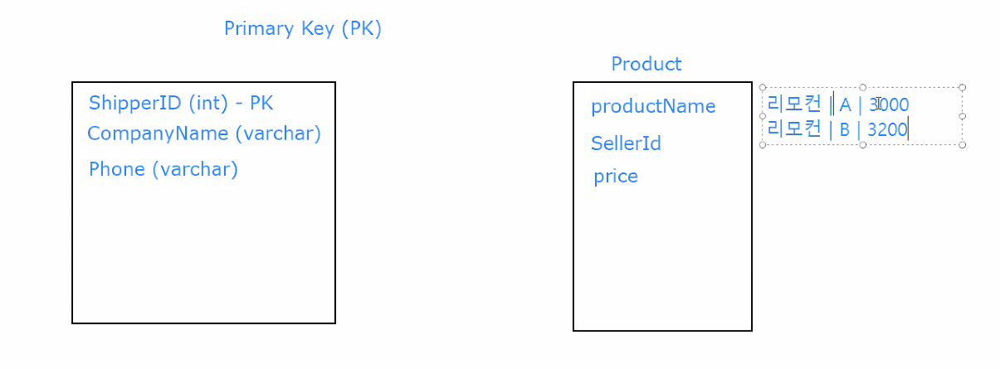
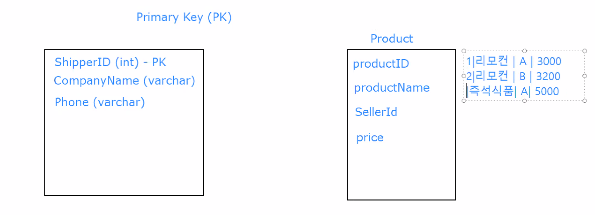
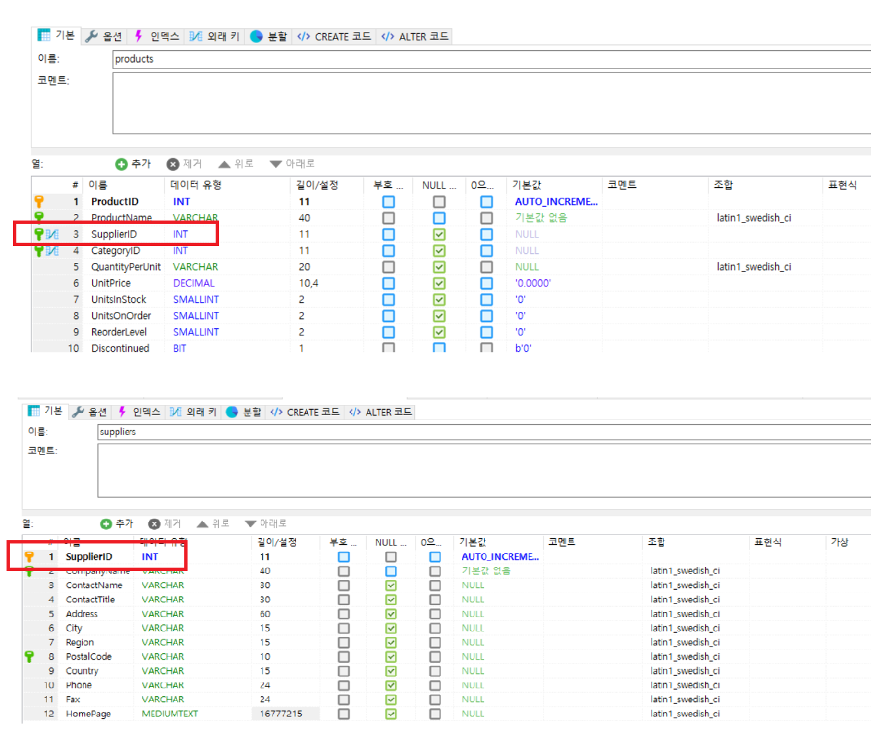
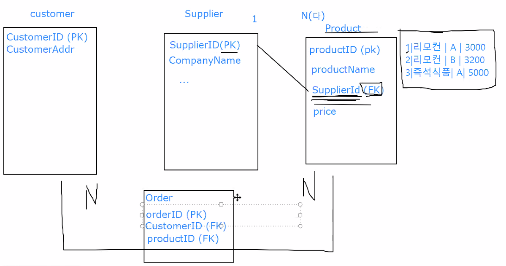
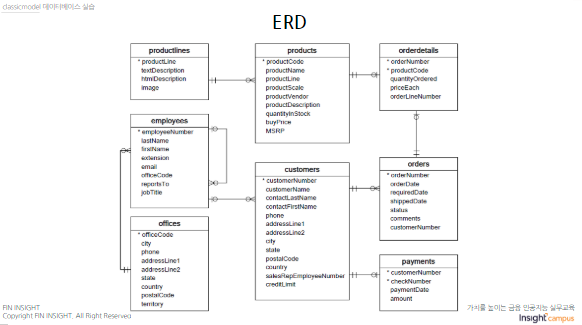

# 데이터베이스 설계 개요


## 1. 테이블 생성


```sql
CREATE TABLE IF NOT EXISTS `Products` (
  `ProductID` int(11) NOT NULL AUTO_INCREMENT,
  `ProductName` varchar(40) NOT NULL,
  `SupplierID` int(11) DEFAULT NULL,
  `CategoryID` int(11) DEFAULT NULL,
  `QuantityPerUnit` varchar(20) DEFAULT NULL,
  `UnitPrice` decimal(10,4) DEFAULT '0.0000',
  `UnitsInStock` smallint(2) DEFAULT '0',
  `UnitsOnOrder` smallint(2) DEFAULT '0',
  `ReorderLevel` smallint(2) DEFAULT '0',
  `Discontinued` bit(1) NOT NULL DEFAULT b'0',
  PRIMARY KEY (`ProductID`),
  KEY `ProductName` (`ProductName`),
  KEY `FK_Products_Categories` (`CategoryID`),
  KEY `FK_Products_Suppliers` (`SupplierID`)
) ENGINE=InnoDB  DEFAULT CHARSET=latin1 AUTO_INCREMENT=78 ;

```


 테이블을 생성하기 위해서는 `CREATE TABLE` 구문을 사용한다. 테이블 생성 시 다음과 같은 제약조건을 설정할 수 있다.

* `NOT NULL` : NOT NULL 제약.

* `PRIMARY KEY` : 기본키 제약.
* `FOREIGN KEY` : 외래키 제약.
* `DEFAULT` : 초기값 설정.

 제약조건은 테이블에서 어떻게 데이터를 받을지 강제하는 것이다.


## 2. KEY

 

 한 테이블 안에서 고유한 행을 선택하기 위해 **PK**를, 서로 다른 테이블을 연결하는 다리를 이해하기 위해 **FK**를 활용한다.

 키 하나만 있으면, `JOIN`을 통해 데이터를 연결하고 가져올 수 있다.


### 1. PRIMARY KEY

 한 테이블에서 해당 데이터(레코드 1개 = 하나의 레코드)를 특정지을 수 있는 키들 중에서 최소의 속성을 갖는 키(Key). 즉, **최소한의 column으로, 단 하나의 row를 식별할 수 있어야 한다.**




> SupplierID만 보면 어떤 상품인지 알 수 있다.


* 키 생성



 제품명(productName)으로는 식별할 수 없다. SellerID 등을 활용해 기본키를 설정한다.


* AUTO_INCREMENT 옵션



 따로 키를 설정하지 않고 `AUTO_INCREMENT` 옵션을 통해 인덱스를 증가시킬 수도 있다.


 

### 2. FOREIGN KEY


 RDBMS에서 관계를 표시하는 핵심적인 개념이다. 서로 다른 두 테이블을 연결하여, 중복을 제거하고 데이터의 일관성을 유지한다.




> 하나의 supplier는 여러 product를 팔 수 있다. 하나의 product는 여러 supplier에게 팔릴 수 없다. 어떤 supplier가 어떤 product랑 관계를 맺고 있는지 관계를 명시해야 한다. 
>
> *"따라서 supplierID라는 외래키를 활용하여 관계를 표시한다."*

 

 관계가 끊어질 때의 옵션을 `SET NULL`, `RESTRICTED` 등으로 설정할 수 있다.


## 3. 관계 설정


 RDBMS는 데이터의 중복을 방지하고 일관성을 유지하기 위해 테이블 간 관계를 설정한다.


 테이블 간의 관계에는 크게 1대1 관계, 1대다, 다대다 관계가 있다. 각 관계를 형성하기 위해  기본키와 외래키를 사용한다. 





 1대다 관계에서 1에 해당하는 테이블에 PK를 N에 해당하는 테이블의 외래키로 활용한다. 다대다 관계에서는 위의 그림에서와 같이 관계를 나타내기 위해 관계에 대한 정보를 담고 있는 테이블을 생성하기도 한다.


## 4. ERD





 테이블 간 관계를 나타낸다.  관계를 활용하여 데이터를 추출하고 조회하기 위해 JOIN을 사용한다.  관계를 해석해서 타고 타고 데이터를 추출해야 한다.


## 5. 인덱스


 인덱스는 데이터베이스 테이블에 붙여 진 **색인**이다. 

 기본키에 지정하지 않아도 다 걸려 있다. 눈에 보이지 않는 인덱스 테이블이 존재한다. 이러한 인덱스는 정렬되어 있다. 실제 테이블에서는 키가 정렬되어서 저장되어 있지는 않다. 예컨대, 인덱스 1은 테이블 ROWNUM 3, 인덱스 2는 테이블 ROWNUM 4 이런 식으로 위치를 가리킨다.


**TRADE-OFF**

 검색속도를 향상시키기 위해 인덱스를 생성한다. 대부분 이진 트리에 인덱스를 저장하고, 이진 탐색 알고리즘을 통해 검색한다. 다만, 인덱스는 생성 시 정렬해야 하기 때문에, 삽입 및 삭제에 많은 비용이 필요하다.


