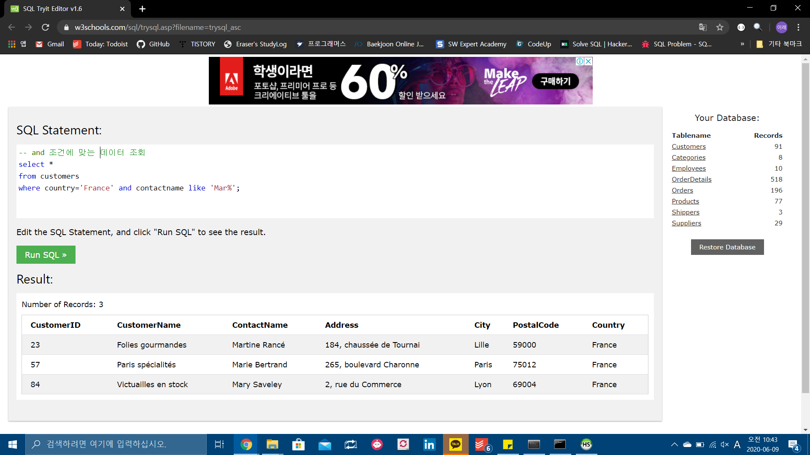
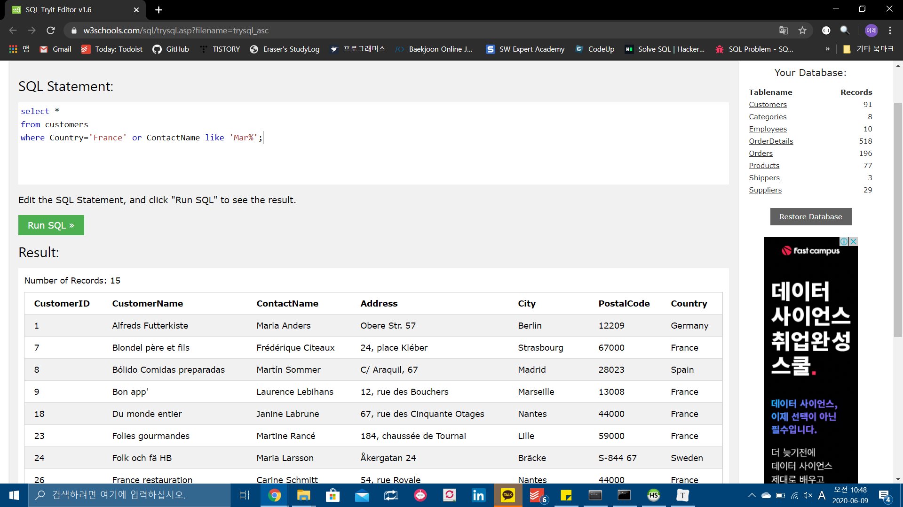
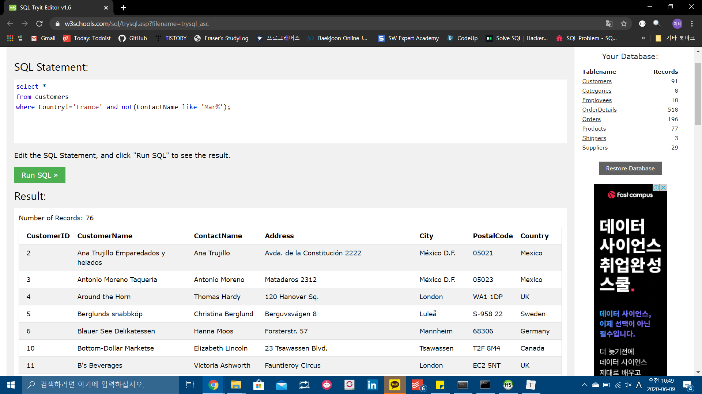
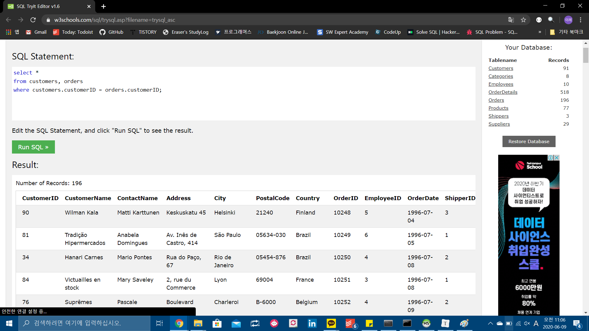
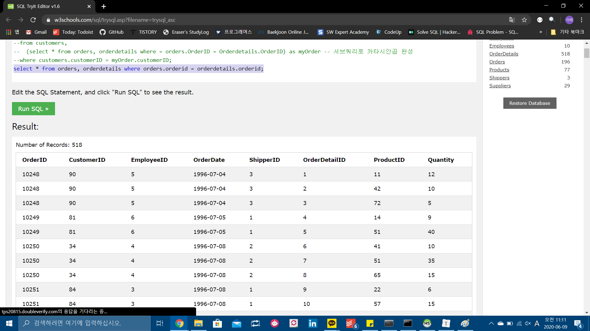
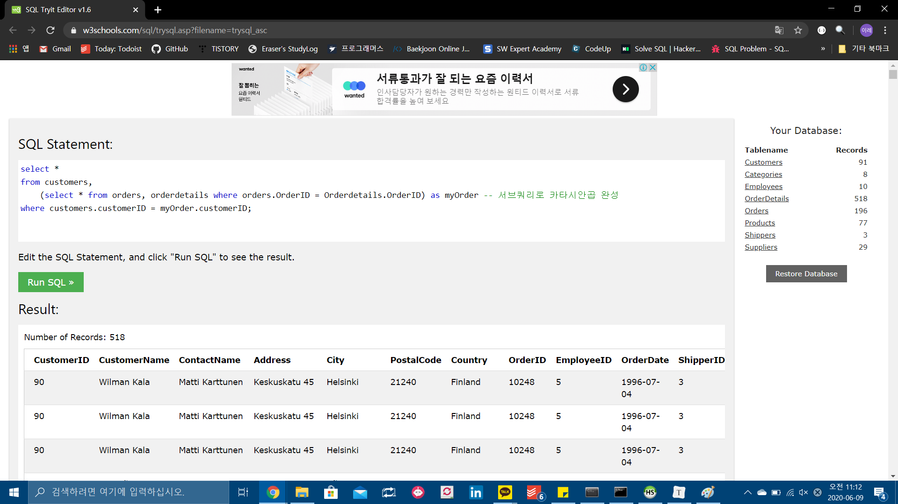
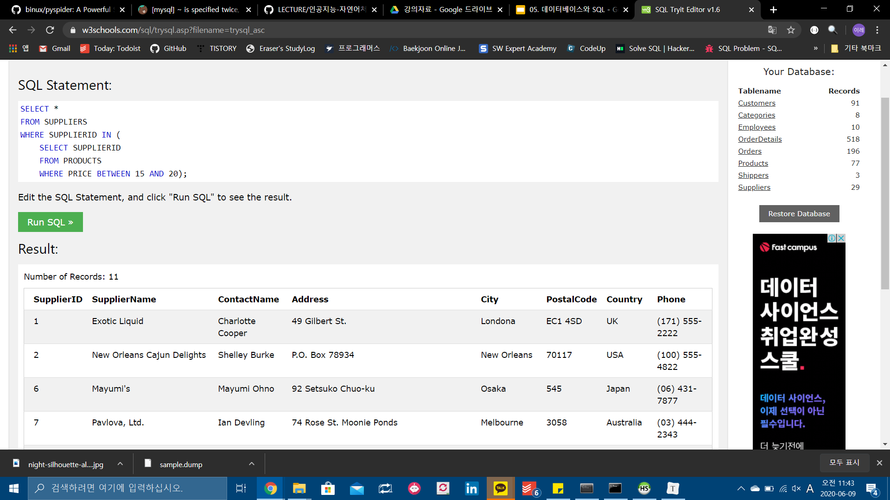

국가가 프랑스이고 이름이 mar로 시작하는 고객 조회




국가가 프랑스이거나 이름이 mar로 시작하는 고객 조회




국가가 프랑스가 아니고, 이름이 Mar로 시작하지 않는 고객 조회.




customer ID 가 같은 레코드 추출




서브쿼리로 카타시안 곱 완성 후, 내부 결합





orders와 orderdetails를 join해서 디테일 정보를 받아 온다. 한 눈에 보기 위해 select. customer와 현재 order를 조인해서 customerid가 같은 애들을 한 눈에 본다.


가격이 15 이상 20이하인 상품을 판매하는 공급자들의 레코드



supplier id가 서브쿼리에서 반환되는 supplier id와 일치하는.


데이터베이스 객체 . 테이블 만들고 삭제하고 등등. 데이터베이스 내에 정의한 모든 것을 지칭. DB에서도 객체. 객체 용어 자체를 혼용해서 쓴다. 객체는 DB 내에서 실체를 갖는 무언가. 

데이터베이스 객체 중 가장 큰 객체는 스키마. 객체 이름이 같아도 스키마가 다르면 다른 객체.


스키마나 테이블은 namespace이기도 하다. 


# join 연산


1. INNER JOIN

   - CARTESIAN PRODUCT에서 중복 제거. 양 쪽 테이블에 모두 데이터가 존재해야 함.
   - 해당 조건에 맞는 열들만 추출.

   ```SQL
   SELECT *
   FROM CUSTOMERS
   JOIN ORDERS ON CUSTOMERS.CUSTOMERID = ORDERS.CUSTOMERID
   ```

   

   * EX1_런던에 위치한 공급자가 생산한 상품 목록 조회

   ```SQL
   SELECT *
   FROM SUPPLIERS AS S
   JOIN PRODUCTS AS P ON S.SUPPLIERID = P.SUPPLIERID
   ```

   


2. LEFT JOIN

* FROM 절의 모든 데이터를 다 가져오되,
* ON 조건에 맞게 가져온다.


3. RIGHT JOIN


2. RIGHT JOIN

1. 국가별 고객수가 5명 초과인 국가만 조회.


