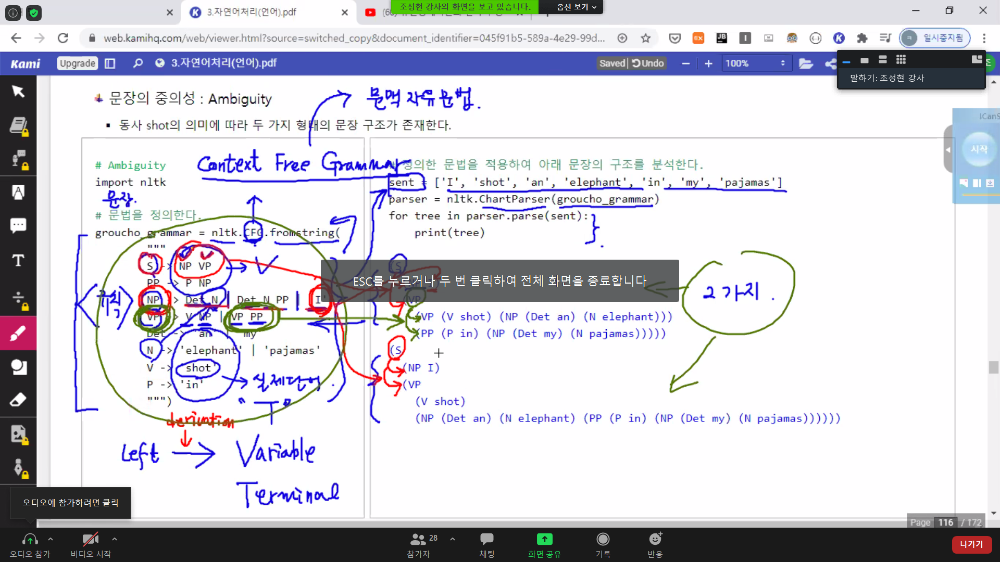
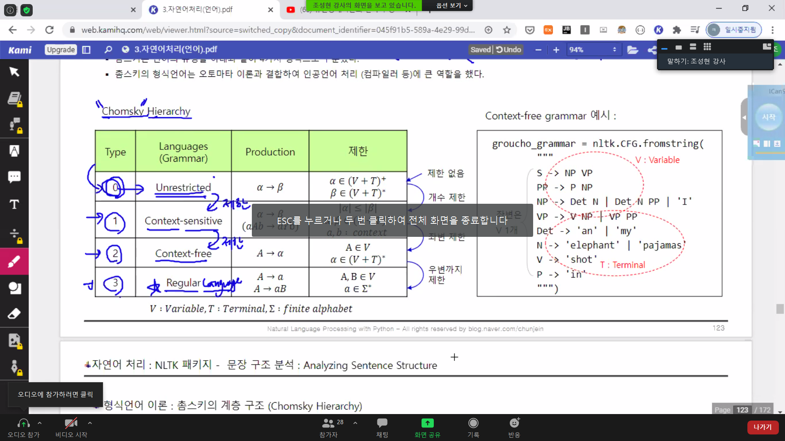
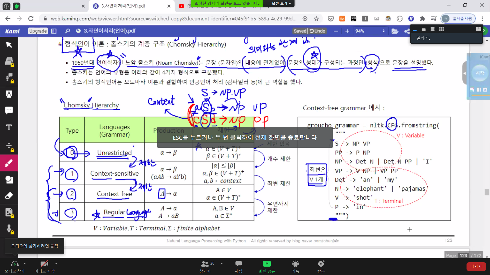
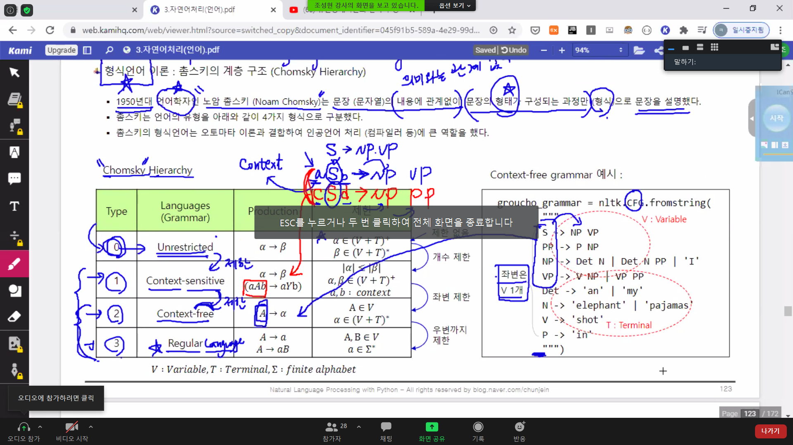
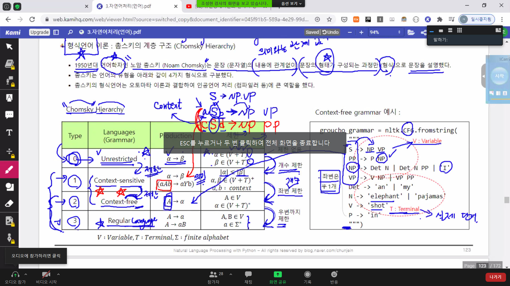

출처가 명시되지 않은 모든 자료(이미지 등)는 [조성현 강사님](https://blog.naver.com/chunjein)의 강의 자료 바탕

# 문장 구조 분석

NP, VP 이런 애들을 variable이라고 하고, 실제 단어를 terminal이라 한다. 

자연어 처리에서 매우 방해가 되는 요소 중 하나.

문장에 대한 문법 정의. nltk CFG - Context Free Grammar. 문맥 자유 문법. CFG에 의해 아래와 같은 문장 string을 읽어 들인다. sentence는 내가 규칙을 만들어 준다. sentence는 크게 명사구와 동사구로 이루어 진다. 

 NP : 명사구라고 하는 것은 or가 들어 있기 때문에 정관사 + 명사이거나, 정관사 + 명사 + 전치사구이거나 i가 나오거나. 이런 식으로 문법을 만든다. 규칙을 만듦. 

 VP : 동사구는 동사 + 명사 구. 동사구 다음에 전치사 구가 나오거나.

NP, VP 이런 애들을 variable이라고 하고, 실제 단어를 terminal이라 한다. 

 

 left에 variable이 나오고 right에 terminal이 나오도록 저 규칙을 줘서 parser로 해석한다. 

 규칙대로 분석한다. 

 sentence = NP + VP : 문장은 명사구와 동사구로 이루어져 있다. 왼쪽에서 오른쪽으로 하는 것을 derivation.

 NP를 derivation하면 세 가지 경우 중 하나. 

 VP를 derivation하면 2가지로 drivation될 수 있고... 왼쪽 규칙대로 문장의 구조가 만들어짐. 

 이렇게 이런 규칙에 의하면 두 가지의 가능한 분석이 나온다.

 그 2개를 tree 형태로 그려 보면 전치사구(PP)가 동사구(VP)에 걸치게 분석될 수 있고, 두 번째로는 전치사구(PP)ㄱ 가 명사에 걸치게 분석될 슈도 있고.

 어떻게 분석하는지에 따라 뜻이 달라진다. 문장에 대한 grammar 정의해서 그 문장을 grammar대로 구조를 분석할 수 있다!

 word-salad. 문법적으로는 완전히 맞지만(형태적으로는) 의미가 없는 문장.

---

## 형식 언어 이론

> 교재 앞 부분에서 가장 중요하다!

 언어는 유한 개의 철자로 무한 개의 단어와 문장을 조합한 것. 따라서 무한한 의미를 생성할 수 있음.

유한 개의 문자를 조합하면 무한 개의 단어가 나오고, 무한 개의 단어를 조합하면 무한 개의 문장이 나오고, 무한 개의 문장을 조합하면 무한 개의 텍스트가 나온다. 인간만이 할 수 있다. 인지 능력.

 인공지능은 이것을 다 인식하기 어렵기 때문에 제한을 가해, 제한적으로 형식화하여 컴퓨터에서 이해할 수 있도록 한다.

 주로 인공 언어 측면에서 많이 다루고, 자연어 처리에서도 어느 정도 제한을 둔 형식을 갖춘 언어로 제한해서 처리한다.

 제한된 언어의 형식으로서의 언어. 

언어를 형식화하는 것의 대가가 바로 촘스키죠!

 Noam Chomsky. 내용에 관계 없이, 의미와 무관하게, 문장의 형태가 구성되는 과정만 형식적으로 설명했다. 이를 형식 언어라고 한다. 이 영역을 formal language theory라고!

 촘스키가 언어의 형태를 4가지로 구성했다. 오전에 한 reg exp와 같은 것들은 regular language. 가장 제약이 많이 걸리는 3번 타입. 무제한으로 unrestricted면, 무제한 언어이면 자연어에 가까운 0번 타입.

 그 사이에 있으면 1, 2. 약간의 제한을 두면 context-sensitve(1), context-free(2) 조금 더 제한을 가한 것.

 컴공에서 컴파일러 할 때 ㅎ형식 언어 이론을 많이 다룬다. 자연어 다루려면 context-free까지. 제한이 생기면서 어려워지는 것.

 elepahnt 뭐 이런 예시에서 context-free grammar로 짜본 게 있었는데. 일단 좌변은 variable 1개. context free grammar. 좌변은 variable이 1개만 있는 경우. 

 예컨대, Sentence = Np + Vp. 만약 좌변에 a가 있따면, ASb -> NP VP

S 주변에 a라는 것과 b라는 것이 나오면 이렇게 derviation하라는 의미이고, 주변에 있는 것인 a, b가 context. 문맥에 따라 라는 의미. cSd -> NP PP 이런 식으로 예를 들면, 똑같은 S가 derivation되는데 주변 문맥에 따라 다른 형태가 나온다.  

 이렇게 좌변에 여러 개의 문법이 나오면 이런 문법을 context sensitve.

 

 그러나 교재 예시 오른쪽처럼 주변 문맥 없이 오른쪽처럼 좌변 1개(문맥에 상관 없이) derivation되면 context free. context sensitive는 주변에 따라 다르게 derivation. 

 unrestricted는 정말 아무런 제한 없이 derivation되는 것. 무제한 언어의 경우 알파에서 베타로 하는데 알파 베타가 아무렇게나 올 숭 ㅣㅆ고 그게 심지어 반복될 수 있음. `*`. 단어의 아무 조합이어도 언어가 되는. 제한이 없는 상태의 언어. 제일 high level. 1차적 제한을 가하면 개수 제한. 좌변 알파 개수가 우변 베타 개수보다 작거나 같아야 한다. 좌변의 개수를 하나로 제한한 것이 3차로 context free. 거기다가 우변까지 제한하면 regular language.

  