# [머신러닝]


## 1. 분류(Classification)


### 1.2. Decision Tree


> 참고: 조성현 강사님 강의 자료, [ratsgo's blog](https://ratsgo.github.io/machine learning/2017/03/26/tree/).


 특정 기준에 따라 데이터에 구분선을 그어 나가며 분류하는 모델이다.(여기서는 분류 모델로 설명하지만, 회귀에도 사용할 수 있다.) 여러 개의 데이터를 가장 잘 구분할 수 있는 질문을 기준으로, 구분선을 긋는다. 

 이렇게 여러 가지 규칙을 순차적으로 적용하면서 데이터를 분할하다 보면, 다음과 같이 데이터를 나누는 기준을 트리 형태로 나타낼 수 있다.


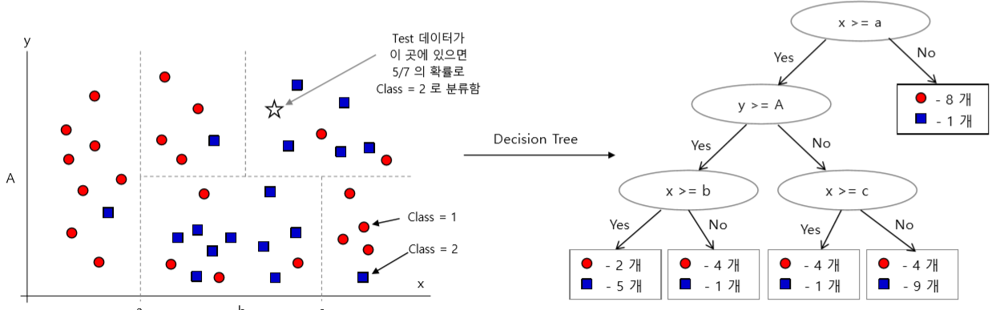

 

* 구분선(decision boundary): 의사결정선. 데이터를 분류하기 위해 긋는 선.
* 분기: 구분선을 기준으로 의사결정나무가 나누어지는 것.
* 리프 노드: 마지막 노드. 


 새로운 데이터가 들어올 때마다 의사결정선을 긋는다. 계속해서 의사결정선을 그어 나가면서, 가장 잘 분류될 때까지 과정을 반복한다.

 

#### 분할 알고리즘


 데이터를 가장 잘 분류하기 위해 최적의 트리 분할 선택 기준을 고르는 것이 중요하다.  분할 선택 기준을 선정할 때는, 불순 척도, 즉 데이터가 섞인 정도가 덜하도록 고르는 것이 좋다. 이 때 불순 척도를 측정하는 지표로, **엔트로피 지수**와 **지니 지수**의 두 가지가 사용된다.


.png)

<center><sup> 1부터 c까지의 i는 클래스를 나타낸다</sup></center>


 다음의 경우(동그라미 2개, 엑스 2개) 엔트로피와 지니 계수를 계산해 보자.


* 엔트로피

$$
G_E = -(\frac {1} {2} \times log_2 \frac {1} {2} + \frac {1} {2} \times log_2 \frac {1} {2})
$$

* 지니

$$
G_G = 1 - (\frac {1} {2})^2 - (\frac {1} {2})^2
$$


 계산해 보면 엔트로피 지수는 1, 지니 지수는 0.5가 됨을 알 수 있다. 각각의 수치는 데이터가 가장 불순할 때 나올 수 있는 수치들이다. 반대로 다음과 같이 데이터가 모두 순수한 경우는, 동일한 방법으로 계산하면 엔트로피 지수와 지니 지수가 모두 0이 된다.


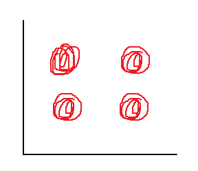


 이를 바탕으로 지니지수와 엔트로피 지수로 측정한 불순 척도의 분포를 그래프로 나타내면 다음과 같다. 둘 모두 데이터가 절반씩 섞여 있을 때 불순 척도가 최대가 된다.


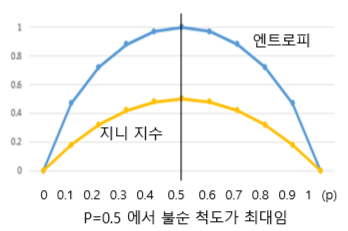


 분할 시에는 어떠한 기준을 선택하든 불순 척도가 감소하도록 선택하는 것이 좋다. 불순도가 감소하는 것을 **정보 획득**이라고 한다. 다시 말하면, 정보 획득이 최대량이 되도록 하는 것이 좋다.


 분할 선택의 과정을 다음의 그림을 예로 들어 설명하면 다음과 같다. (지니 지수를 기준으로 설명한다.)


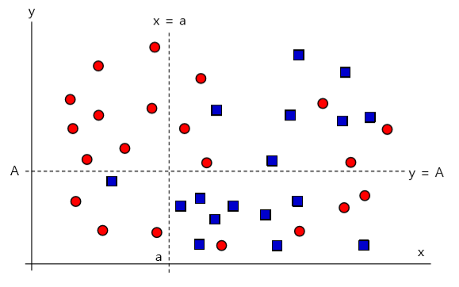


 초기 분할 선을 `x = a`로 선택하거나(좌우 분할), `y = A`로 선택한다(상하 분할)고 하자.

 좌우 분할로 선택하는 경우, 왼쪽 영역의 지니 지수는 0.153, 오른쪽 영역의 지니 지수는 0.473이 된다. 각 경우의 지니 지수를 가중평균하면, 좌우의 선을 초기 분할선으로 선택하는 경우 지니 지는 0.372가 된다. 완전히 불순할 때의 지니 지수가 0.5임을 감안한다면, 분할을 통해 0.128(=0.5-0.372)의 정보량을 획득했다고 볼 수 있다. 

 같은 방식으로 상하 분할선을 선택한다고 하면, 위쪽 영역의 지니지수는 0.444, 아래쪽 영역의 지니 지수는 0.484가 된다. 가중평균한 값은 0.462이므로, 분할을 통해 0.038의 정보량을 획득했다.

 정보 획득량을 계산할 때 가중평균을 취하는 이유는, 데이터의 수에 영향을 받지 않도록 하기 위함이다. 극단적으로 데이터가 1개만 존재하도록 분할선을 긋는다면, 가장 순수한 데이터 영역이 만들어질 것이다. 이처럼 데이터의 수를 적게 해놓고 순도가 높다고 하는 것을 방지하기 위해 가중평균의 과정이 필요하다.


 이렇게 초기분할을 하는 경우를 비교했을 때, 불순도가 더 낮아지고, 정보량 획득이 많아지는 첫 번째 방법으로 분할선을 선택하는 것이 좋다. 


 이렇게 **정보 획득량이 더 많아지도록** 계속해서 트리를 분기해 나가는 것이 의사결정나무의 원리이다. (물론 무수히 많은 분기의 과정을 거칠 수 없기 때문에, 내부적으로 `quantile`  등의 알고리즘을 사용하여 분기한다.)


#### 특징

* 분류나 예측의 근거를 알 수 있으므로, 결정 과정에 대한 이해가 쉽다.
* 데이터의 차원이 높아져도(feature가 많아지더라도) 분류에 중요한 feature들을 제외할 수 있으므로, feature 선정에 크게 신경쓸 필요가 없다.


#### 모델 학습


 다른 사이킷런 모델과 마찬가지로 다음의 과정을 거쳐 모델을 학습한다.

* `model.build` 
* `model.fit` : 트리를 생성한다. 지니 지수나 엔트로피 지수 등 불순 척도를 계산하고, 학습 데이터를 이용해서 학습 데이터로 트리를 만든다.
* `model.predict` : 생성한 트리를 바탕으로 새로운 데이터가 어느 영역에 속할지(회귀의 경우에는 어떤 값을 가질지) 예측한다.


 모델의 파라미터 중 중요한 것으로는 정보량 획득 계산의 기준을 무엇으로 할 것인지의 `criterion`과, 트리를 어느 단계까지 생성해 나갈 것인지의 `max_depth`가 있다.

 `max_depth`의 경우, default 값은 `None`이다. 마지막 노드에 데이터가 1개 남을 때까지 트리를 분기해 나간다. 이 경우, 당연히 마지막 노드에 데이터가 1개 남기 때문에, pure해진다.


#### 문제: 과적합

 breast cancer 데이터 실습 결과를 보자. 


|                             Gini                             |                           Entropy                            |
| :----------------------------------------------------------: | :----------------------------------------------------------: |
| 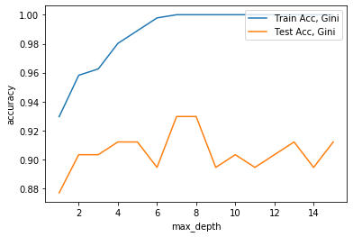 | 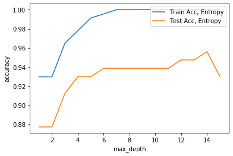 |


  train set에 대한 정확도가 어느 순간 이후 100%가 되는 것을 볼 수 있다. 자신의 데이터로 트리를 구성한 후, 그 데이터를 대입하니 잘 맞출 수밖에 없다.

 트리의 깊이가 깊어질수록, 의사결정나무 알고리즘은 맨 끝의 leaf node가 1개 남을 때까지 트리를 만들어 나간다. 깊이가 무한해질수록 순도가 높아지고, 학습 데이터를 정확히 맞출 수밖에 없는 구조라는 말이다. 그래서 max_depth를 늘리며 학습을 진행해 나갈수록 train set에 대한 정확도는 높아질 수밖에 없다.


 그렇다면 이렇게 train accuracy가 높아지는 것이 좋은 상황일까?  그렇지 않다. **과적합**된 상황이다.

  뎁스가 깊어질수록 학습 데이터는 잘 설명하는데, 새로운 데이터는 제대로 맞추지 못한다는 의미다. 알고리즘이 학습 데이터를 달달 외워 버리는 상황이다. **적절한 뎁스가 어디인지** 결정하는 일이 매우 중요하다.


 income 데이터로 진행한 실습을 보더라도, 뎁스가 깊어질수록 train accuracy는 100%에 가까워지지만, test accuracy는 7 부근에서 꺾이는 것을 볼 수 있다.


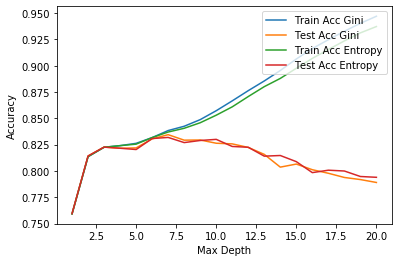


> *pd.Categorical*
>
>  Pandas가 알아서 범주형 변수를 숫자 카테고리로 바꿔 준다.
>
> ```python
> >>> pd.Categorical(income['workclass']) # 문자 형태의 범주형 변수를 Pandas는 어떻게 범주로 바라보는가.
> Out[6]: 
> [State-gov, Self-emp-not-inc, Private, Private, Private, ..., Private, Private, Private, Private, Self-emp-inc]
> Length: 32561
> Categories (9, object): [?, Federal-gov, Local-gov, Never-worked, ..., Self-emp-inc, Self-emp-not-inc, State-gov, Without-pay]
>     
> >>> pd.Categorical(income['workclass']).codes # 변경된 문자 형태 범주의 숫자 코드
> Out[7]: array([7, 6, 4, ..., 4, 4, 5], dtype=int8)
> ```


#### 정규화: 과적합 방지


 그렇다면 과적합을 방지하기 위해서는 어떻게 해야 할까?


|                                                | 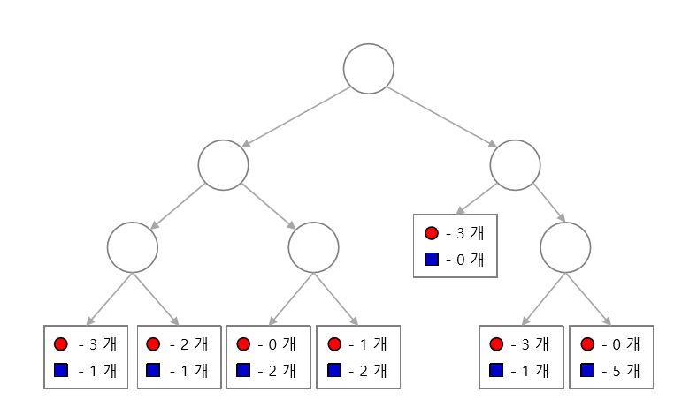 | 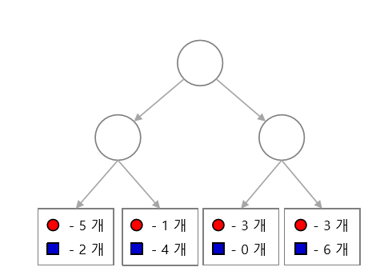 |
| ---------------------------------------------- | :----------------------------------------------------------: | :----------------------------------------------------------: |
| 트리 depth                                     |                              3                               |                              2                               |
| 리프 노드 개수                                 |                              7                               |                              4                               |
| 잘못 분류                                      |                              4                               |                              6                               |
| 에러율<br>(잘못 분류된 개수/ 전체 데이터 개수) |                             4/24                             |                             6/24                             |


 오른쪽 트리가 에러율이 더 높아서 왼쪽 트리가 더 좋은 트리라고 생각할 수 있다. depth가 깊어질수록 에러가 감소하는 것은 당연하다. 학습 데이터에 대해서는 그럴 수밖에 없다. *문제* 는 시험 데이터이다. 학습의 이유는 새로운 데이터를 알아맞추기 위함이다. 그런데 뎁스가 깊어질수록 시험 데이터에 대한 정확도가 어느 정도 증가하다가 낮아진다. 학습 데이터의 accuracy는 지속적으로 올라가지만, 시험 데이터의 accuracy는 증가하다가 감소한다. 


**결국 에러가 적고, 정확도가 가장 높은 지점의 depth를 찾는 것이 중요하다!**


 다시 위의 이야기로 돌아가 보자. 위의 그림에 있는 데이터는 모두 다 학습 데이터이다. 결국 여기서 측정된 잘못 분류된 개수, 즉, 에러율은 학습 데이터에 대한 에러율이다. depth가 증가할 때 학습 데이터에 대한 에러율이 감소하는 것은 자연스러운 이야기이다. 하지만, 시험 데이터가 어떤지는 알 수 없다. 학습 데이터의 에러율만 가지고 좋다, 나쁘다 이야기할 수 없다. 

 결국 depth가 커질수록 벌점을 줘서 오류율을 전반적으로 다시 판단해야 한다. 페널티 term을 에러 공식에 추가한다. 뎁스가 클수록, 점수가 낮아지게 식을 표현한다. 


 에러 공식을 다음과 같이 수정해 보자. 
$$
e_\alpha = \frac {e + N \times \alpha} {D}
$$


* 트리가 깊을수록 리프 노드의 수가 기하급수적으로 증가한다.
* 따라서 전체 데이터 개수 대비 리프 노드의 개수(N)를 벌점의 기준으로 삼는다.
* 이 때, 벌점을 얼마나 매길 것인지를 알파로 조정한다.


 예컨대, 알파를 1로 하여 두 트리의 에러율을 다시 계산하면 다음과 같다.

|                 | 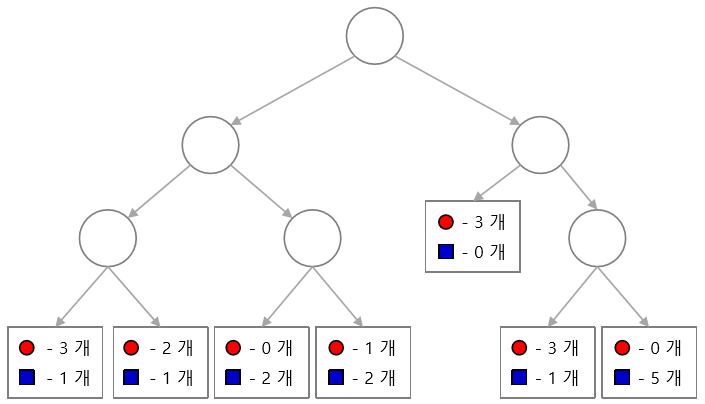 |  |
| --------------- | ------------------------------------------------------------ | ------------------------------------------------------------ |
| 수정 <br>에러율 | 11/24                                                        | 10/24                                                        |


 오른쪽 트리에서 수정 에러율이 더 낮다. 학습 데이터는 왼쪽 트리가 더 잘 설명하지만, 시험 데이터에 대해서는 오른쪽 트리가 더 잘 설명할 여지가 있다. 왼쪽 트리의 과적합 상황을 오른쪽 트리에서처럼 적절하게 조정했다고 보면 된다.


 알파가 0이면, 에러율 공식은 N/D가 되기 때문에, 당연히 D를 최대화하려고 한다. 


이렇게 과적합을 조정하는 과정을 **정규화**(regularization)라고 한다. 규제항을 통해 일반화 성능을 향상시키는 방법이다. 페널티항을 벌점으로 추가해서 일반화 성능을 향상시키는 것이다. 이를 통해 과적합을 방지한다.


> 딥러닝할 때 또 나오는 얘기니까, 잘 기억해 놓자!!!


 에러율 공식에서 알파를 regularization constant라고 한다. 위에서는 임의로 1.0을 적용했다. 분석자가 임의로 적용한 항이다. 분석자가 자신만의 경험이나 노하우를 통해 결정한다. 이렇게 규제항을 통해 학습 뿐만 아니라 새로운 데이터까지 잘 설명하고자 한다.


# 가치치기


 사전 가지치기. depth가 너무 깊어지지 않게 사전 가지치기를 통해 트리를 간단하게 만든다. 처음에는 depth가 작은 트리를 구성했다가 depth를 2로도 구성해 보고, 점점 depth를 늘려 나간다. 간단한 트리에서 복잡한 트리로 가는데, 어딘가 error가 늘어나는 측면에서 가지치기를 중단. 그런 의미에서 사전 가지치기라고 한다. 

 방금 한 것처럼 depth를 늘려 나가며 중간에 적절한 depth를 찾는 것. 


# 사후 가지치기


최대한 복잡하게 만든 다음에 필요 없는 트리를 잘라 내면서 간소화한다. 진정한 의미에서의 가지치기.


 결정트리의 정규화(과적합 조정)는 가지치기를 통해 이루어진다. depth의 수나 알파의 크기를 통해 가지치기를 진행할 수 있따. 


알파를 이용해서 최적 트리를 만드는 방식이 사후 가지치기.

트리를 최대한 복잡하게 만든다.


사이킷런에서는 `cost_complexity_pruning_path`로. 

ccp  alpha와 impurities 그림 그린ㄷ.

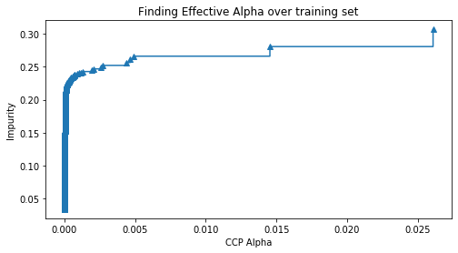


마지막 트리는 어차피 depth가 0이므로, 트리를 분기하지 않았다는 말. 제외.

steps-post 옵션

alpha가 너무 작아서 조밀한 애는 제외


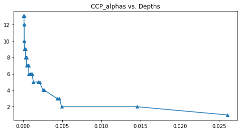


train data fit한다. ==> eval 통해 적절한 알파를 찾는다. 여기까지가 분서 ㄱ완료. test data를 가지고 최종 성능 평가.

지금까지 우리가 한 건 eval/validation data 없었음.

train data는 학습에 직접 사용된 것이고, 알파를 찾는 최적화 과정에서 validation data도 참여한 것. eval data는 학습에 간접적으로 사용된 것.최종 평가 시에는 학습에 사용하지 않은 테스트 데이터를 찾아야 한다!


13페이지 그림 기준.

지금은 feature가 2개다. 그런데 동일한 feature가 트리 분기 과정에서 여러 번 사용될 수 있다. x를 기준으로 분할했다면, 그 x가 패런트 노드가 되고, y가 차일드 노드가 된다.

 패런츠로 계싼한 지니 지수와 차일드로 계산한 지니 지수의 차이가 정보량 획득이라고 했죠!

 이 분기를 이용해서 나누는 것이 정보량 획득에 얼마나 기여하는지를 계산할 수 있다. 그 이득이 0보다 작으면 분할하면 안 됨. 분할해서 이득이 생겨야 분기하는 게 좋다.


 각 분기 과정에서 노드에서 inf gain이 생겼겠지. x에 대해 inf gain의 평균을 내고, x는 이 트리를 만드는 데 평균적으로 얼마나 기여했는가. 


트리 분기 완료 후 피쳐 별로 얼마나 불순도를 감소시켰는지! 평균 감소율을 계산하면 피처들의 중요도를 판단할 수 있다. 얼마나 중요한 피쳐였는가. 특정 피쳐가 불순도를 감소시키는 데 크게 기여했다면 그 피쳐는 중요한 것으로 판단. 예컨대 인컴 데이터에서는 사람 수입을 예측하는 데 어떤 피쳐가 중요한 역할을 하는가 


# 특성 중요도

 빈 공간이 많으면 안 된다. 학습데이터는 기계에게 경험을 시키기 위한 데이터. 빈 공간이 많으면 기계가 경험할 게 그만큼 줄어듦. 데이터 개수가 많을수록 공간을 밀도 있게 채울 필요가 있다.

 그래야 풍부한 경험을 할 수 있다. 만약 데이터 100개를 써서 공간을 어느 정도 밀도 있게 채웠다고 한다면. 거기에 다른 특성을 하나 더 추가한다고 해보자. 그러면 2차원으로는 안 되고 3차원이 필요하죠/1

 그러면 밀도가 낮아진다. 확 떨어진다. 기계가 경험하지 못하는 빈 공간이 많이 생긴다.

 빈 공간이 늘어난다. 빈 공간을 줄이기 위해서 데이터를 늘려야 한다. 데이터가 더 많이 필요하다. 밀도 있게 채우기 위해서!

 피쳐를 하나 아무 생각 없이 추가했을 뿐인데, 필요한 데이터 양은 훨씬 많아진다. 2차원 공간, 3차원 공간으로 갈수로 빈 공간이 기하급수적으로 늘어나며 필요한 추가 데이터의 양이 기하급수적으로 늘어난다.

 데이터를 얼마든지 수집할 수 있다면 피쳐를 추가하는 게 문제가 안 되지만, 제한적인 데이터만 갖고 있고 추가 데이터 확보가 어렵다면 피쳐 추가가 문제가 된다. 차원의 저주!


피쳐가 많을수록 데이터의 특성을 세부적으로 나타내줄 수 있다. 피쳐는 많을수록 그 데이터으 ㅣ속성을 잘 나타내기 때문에 좋다. 그러나 공간을 밀도 있게 채울 수 없다는 문제점 때문에 피쳐를 마냥 늘릴 수가 없다.


그렇다면 어떻게?

1) 데이터를 늘리자.

 2) 피쳐를 줄이자. 이 때 중요도 분석이 중요.

​	 덜 중요한 피쳐들은!

 

그 외에 PCA 주성분분석도 있습니당!


