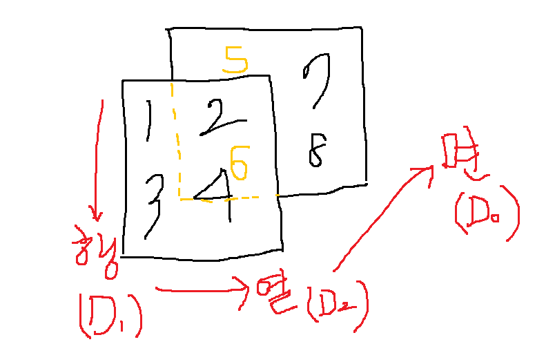

# 금융과 자연어처리

 금융권, 은행, 증권사 등 금융권에서 디지털 금융이 화두. 2016년 정도부터 끊임없이 관심 + 투자. 알파고와 이세돌 9단의 대국이 컸다. 

**투자 부문**

 2016년 정도부터 미래에셋대우 디지털금융 신설. 2016년 9월경 여의도 포스콤 로보어드바이저(투자 관련 의사결정에 인공지능 도움을 받는다).  투자 의사결정에 있어서 도움. 로보어드바이저는 2019년 경부터 더 활성화되도록 제도적으로 지원. 이후 로보어드바이저 비대면 계약 전면 허용.

**서비스 부문**

 2017 대신증권 챗봇  출시. 인공지능과 사람이 대화하는 다이얼로그 시스템. 기존에 콜센터 직원이 대화하던 것을 인공지능과 일반 소비자가 대화를 나누도록.  많은 관심 받았다. 2019년 2월 KB증권 챗봇.

 우리가 하려는 자연어 처리는 챗봇, 로보어드바이저와 일부 관계가 있다. 딥러닝 분야 역시 로보어드바이저와 밀접한 관계가 있다. 특히 챗봇의 경우, 콜센터를 대체할 수 있다면 창출할 수 있는 부가가치가 매우 크다.

---

# 데이터 분석

>  목적이 데이터 분석이고, 수단은 머신러닝과 딥러닝이다. 머신러닝, 딥러닝이 그 자체로 목적이 될 수는 없다. 데이터 분석을 위해 사용하는 것임을 잊지 말자.

## 1. 종류

* 정형 데이터(수치. 깔끔)

* 비정형 데이터(깔끔하지 못한) : 당연히, 분석하기 어렵다.

## 2. 알고리즘

### 2.1. 머신러닝

* 데이터를 어떻게 효과적으로 분류할 것인가: KNN, Decision Tree, SVM, 나이브 베이즈, ANN, 랜덤포레스트, XGBoost.
* 데이터를 어떻게 효과적으로 군집화할 것인가.

### 2.2. 딥러닝

* Artificial Neural Network(ANN)의 세분화.
* Perceptron, Multi Layer Perceptron, RNN/LSTM/GRU, CNN, GAN, Auto Encoder, RBM, DQN 등.

 *비정형 데이터* 의 경우는 정형 데이터로의 변환 과정을 거쳐 위와 같은 알고리즘을 적용하게 된다. 어떻게 변환할 것인가에 대한 많은 이론이 있다. 물론 도메인 지식이 있으면 좋다. 그러나 요즈음에는 머신러닝, 딥러닝 수준에서도 데이터 변환에 대한 기술이 개발되고 있기 때문에 몰라서 못하는 것까지는 아니지 않을까? (~~강사님께서도 조심스러운 부분~~)

> 예컨대, 자연어의 경우 Word2Vec, Word Embedding, CBOW, Skipgram, FastText 등 알고리즘을 적용할 수 있다. 이를 통해 Seq2Seq, Transformer, BERT 등 알고리즘을 적용해 기계번역, 기계독해, 감성분석, 요약 등의 작업을 진행한다.

---

# 기본적 용어

* 스칼라

* 벡터 : 1차원

* 행렬 : 2차원.

  * 행 : dimension 0(`axis=0`)
  * 열 : dimension 1(`axis=1`)

* 다차원 구조 표현법 : 차원에 따라 축이 달라진다.

  * 2차원 : `[[1, 2], [3, 4]]`
  * 3차원 : `[[[1,2], [3, 4]], [[5, 7], [6, 8]]]`

  

  

  

  

  * 텐서 : 스칼라, 벡터, 매트릭스 모두 일컬음.
    * 스칼라 : rank = 0인 텐서.
    * 벡터 : rank = 1인 텐서.

 

* 변수의 형태

| 숫자형(Nominal)                                            |                     범주형(Categorical)                      |
| ---------------------------------------------------------- | :----------------------------------------------------------: |
| * 이산형(Discrete) : 정수. * 연속형(Continuous) : 실수. | * 명목형(Nominal) : 순서 관게 없음. ex) 남녀 * 순서형(Ordinal) : 순서 관계 있음. ex) 학년 |
| * Interval형  * Ratio형                                 |                                                              |

