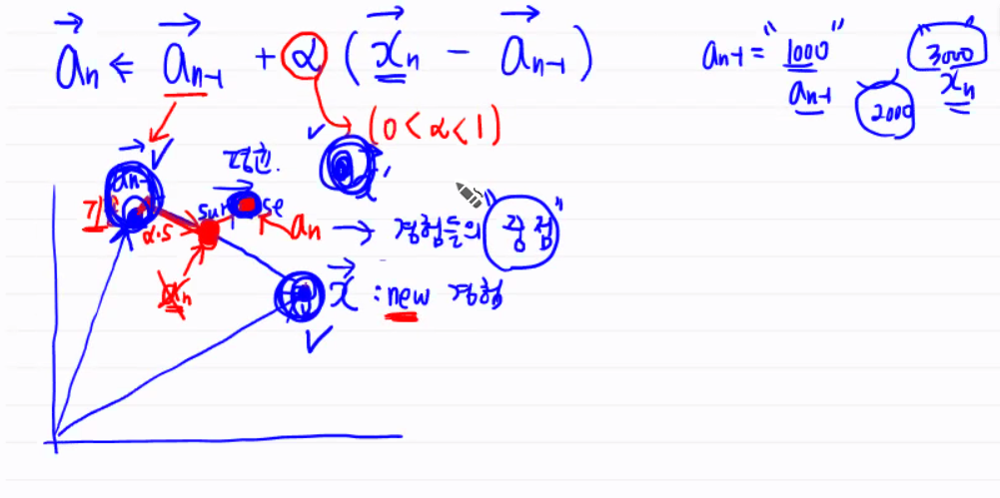
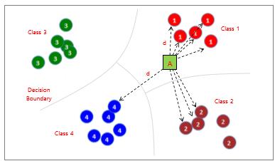
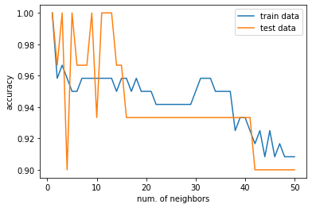
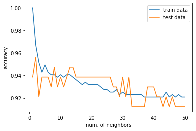
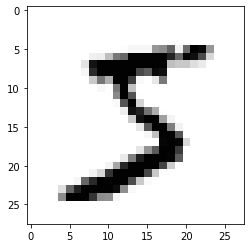
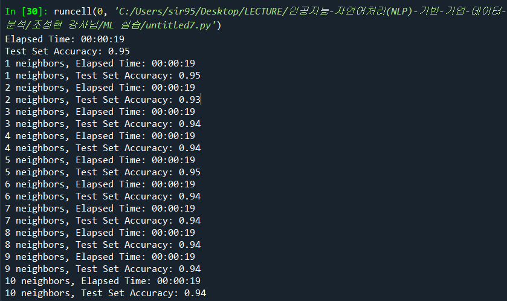
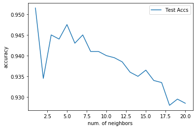
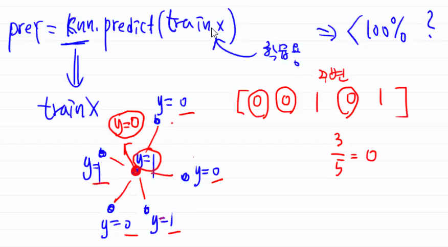

> 스파이더 사용합니다!

# [머신러닝]


## 0. 용어

* 특성(feature) : 데이터의 구조.


* 학습(train)	

  > *심리학*
  >
  > * 구성주의 ~ 기능주의 ~ 경험주의.
  > * 행동주의
  >   * 스키너 비둘기 실험: 경험에 바탕을 둔 학습. 먹이와 버튼 간 연관관계.
  > * 인지주의
  >   * 원숭이 실험. 고등 동물, 인지에 의한 학습.

  

  ​	현재까지 기계학습의 바탕은 대부분 경험주의를 따른다. 일일이 가르쳐 주는 지도학습이라고 보면 된다. 현재 수준에서 기계는 인지에 의한 학습을 하지는 못한다. 그래서 현재까지 인공지능은 경험에 의해 학습을 하는 시스템이라고 생각하면 된다.

  

   *언젠가* 기계가 인지에 의해 학습을 하게 된다면...? Super Intelligence...?

  

   기계가 인지에 의한 학습을 할 수 있도록 연구하는 분야가 메타 러닝. 그러나 유의미한 성과가 나오지는 않는다.


### 기계의 학습


 기계가 학습을 하기 위해서는 *수많은* 경험이 필요하다. 그래서 빅데이터에 의해 경험적인 학습을 시키는 것이 현재 기계학습에서 대부분을 차지한다. 경험주의 학습에 있어서 하나의 큰 **단점**이기도 하다.

 현재 인공지능이 채택하는 학습 방법론은, **수많은 경험을 하고, 그것을 *평균* 내는 방식.** 수많은 학습 알고리즘의 근본이 결국은 "평균"이다.


### 평균 알고리즘


$$
a_n = \frac {x_1 + ... + x_n} {n-1} \times \frac {n-1} {n}
$$

$$
a_n = a_{n-1} \times \frac {n-1} {n} \times {x_n} \times \frac {1} {n}
$$

$$
a_n = a_{n-1} + \frac {1} {n} \times (x_n - a_{n-1})
$$


 경험 학습의 기본 원리는 다음과 같다.

-  `$a_n$ ` 과거의 경험을 보여주는 추정치 = 기존 지식

- xn 새로운 데이터 발생, an-1 기존 지식
- 기존에 알고 있던 게 잘못되면 업데이트 하는 방식. 그래서 새로운 지식으로 학습이 일어난다.
- 차이를 surprise라고 하는데, surprise가 발생하면 경험 학습이 이루어진다.


 이를 다음과 같이 나타내면, 학습률을 알파라고 할 수 있다. 차이를 *얼만큼의 비중으로 반영해서* 기존의 지식을 새로운 지식으로 업데이트할 것인지의 여부이다.
$$
a_n = a_{n-1} + \alpha \times (x_n - a_{n-1})
$$

 알파가 클수록 과거의 경험을 중요하게 반영하고, 알파가 작을수록 과거의 경험이 아니라 현재의 변화에 주목하는 학습 방식이 된다. 알파의 크기에 따라 분석자가 어떻게 학습시킬 것인지를 선택하게 된다. 순환신경망 중 LSTM 알고리즘의 경우, 알파 값을 자동으로 조절하는 알고리즘이 있다.

 

 기하학적으로 이해해 보자. 각각을 벡터로 이해해 보자. 벡터 공간에서 이들은 어떠한 의미를 가지게 될까? 새로운 지식이 계속해서 업데이트되는 것을 의미한다.

{: width="50%" height="50%"}


* 예측/추정(predict)

 


## 1. 분류(Classification)


### 1.1. KNN





  새로운 데이터가 들어왔을 때, 기존의 모든 점들과의 거리를 전부 계산한 후, 가장 가까운 K개의 점들을 기준으로 분류하게 된다.  해당 K개의 점들 중 가장 많은 점이 속해 있는 클래스가 새로운 데이터의 클래스가 된다.

 feature가 2개밖에 없을 때는 2차원 공간 상에서 육안으로 확인할 수 있지만, feature가 많아지면 어렵다. 따라서 거리를 계산해서 알고리즘에 의해 판단하게 된다.

 알고리즘적으로 하는 일이 크게 없어서 *lazy algorithm*이라고도 한다. 새로운 데이터가 들어왔을 때, 기존 데이터 간의 거리를 재서 이웃을 뽑기 때문이다. 다른 알고리즘과 달리, **학습**이라고 할 만한 절차가 별로 없다. 미리 학습해 두는 방식이 아니라, 새로 시험 데이터를 추정할 때마다 학습하는 방식이기 때문에 시간이 오래 걸린다. `.fit`에서는 아무 것도 하는 게 없다. `.predict`로 가야 뭔가를 한다. LAZY!


 하이퍼파리미터로는 탐색할 이웃의 수(`k`), 거리 측정 방법의 두 가지가 있다.


#### 1) 거리 계산 방식

* 맨하탄 거리 : 같은 성분끼리의 거리. 
* 유클리드 거리 : 두 점 사이의 기하학적인 최소 거리.
* 민코프스키 거리 : 맨하탄 거리와 유클리드 거리의 일반화. m제곱한 후 m제곱근을 씌워주는 거리. 두 성분 중 더 크게 떨어진 성분으로 수렴하게 된다. 많이 떨어진 특성을 부각시키려고 할 때 사용한다.


 어떤 게 더 좋은 거리 계산 방식인지는 모른다. 각각의 특징이 있기 때문에 모두 다르다.


#### 2) 차원의 저주

  KNN 알고리즘은 '차원의 저주'에 취약한 알고리즘이다. '차원의 저주'란, 차원이 증가할수록 학습 데이터의 수가 차원의 수보다 적어져 알고리즘의 성능이 저하되는 것을 의미한다.

.png) 

<center><sup>차원의 저주</sup></center>


  KNN 알고리즘의 경우, 차원이 증가할수록 더 멀리 떨어진 훈련 데이터를 참고해야 하기 때문에, '근접 이웃'을 활용하는 알고리즘임에도 불구하고 '가까이 있는' 이웃이 아니라 '멀리 있는' 이웃을 참조하게 되는 모순이 발생한다.


#### iris dataset 실습

> scikit-learn의 KNN 분류기를 활용해 iris dataset을 분류해 보자.

 scikit-learn의 KNeighborsClassifier에서 default 거리 계산 방식은  'Minkowski' 방식이다. 이 때 p=2이면, 거리 계산 방식에서 m=2인 것과 같다. 곧, default setting일 때는 유클리디안 거리를 사용하는 것임을 의미한다.




<center><sup>이웃의 수를 조정했을 때 train accuracy, test accuracy의 변화</sup></center>

 neighbors의 수를 조정하며 학습용, 시험용 데이터 셋의 정확도를 측정한 결과, 이웃의 수(`k`)가 증가할수록 정확도는 감소한다. 이 경우, k = 13 ~ 18 부근이 적당해 보인다.


#### breast cancer dataset 실습

> scikit-learn의 KNN 분류기를 활용해 breast cancer 데이터 셋을 분류해 보자.


 feature 개수가 상당히 많다.

.png)

 이렇게 feature 수가 data 수에 비해 많을 때는, 차원의 저주 문제를 고려해야 한다.





 iris 데이터셋과 마찬가지로 k가 증가할수록 정확도는 낮아진다. k = 5 ~ 8 부근으로 설정하는 게 적당해 보인다.


#### MNIST dataset 실습

> scikit-learn의 KNN 분류기를 활용해 MNIST 데이터 셋을 분류해 보자. 다운로드하는 데에 시간이 오래 걸리기 때문에, 강사님이 미리 저장해 둔 MNIST pickle 데이터를 활용한다.


 임의로 데이터 하나를 확인하면 다음과 같다.

 ```python
sample_img = mnist['data'][0]
sample_img # 0 ~ 784까지 픽셀 강도
sample_img = sample_img.reshape(28, 28) # 
plt.imshow(sample_img, cmap='Greys')
 ```



<center><sup> 첫 번째 이미지를 확인한 결과 </sup></center>


 데이터 개수가 많기 때문에, 10000개 데이터만 활용해 실습을 진행한다. 



 이전과 달리, 점수를 측정할 때, 사이킷런에 내장된 `.score` 함수를 활용한다.

```python
# 모델 학습
knn = KNeighborsClassifier(n_neighbors=5)
knn.fit(X_train, y_train)

# 정확도 계산
knn.score(X_test, y_test)
```


 MNIST 데이터셋과 같이, 데이터 개수가 많은 경우 KNN 알고리즘을 활용하면 시간이 오래 걸린다. 위에서도 말했듯, 시험 데이터가 들어올 때마다 거리를 재는 *lazy-learning* 방식이기 때문이다.


 이웃의 수를 조정해 가며 확인한 test set accuracy는 다음과 같다. (이번 실습에서는 20까지만 진행했다.)




---


## Q&A


* train data를 가지고 예측했는데 왜 정확도가 100%가 아닌가요?

  

 


 주변에 있는 애들이 모두 0이지만, 내 데이터의 클래스는 0이라고 하자. 주위에 있는 애들의 클래스에 의해 판정하는 알고리즘이기 때문에, 학습용 데이터로 예측해도 달라질 수 있다. **주변**에 무엇이 있는가에 따라 다르다.


* 이웃의 수가 짝수인 것과 홀수인 것?

 짝수면 우연히 5대 5일 수도 있으니까, 홀수인 게 더 좋을 수도 있겠다?