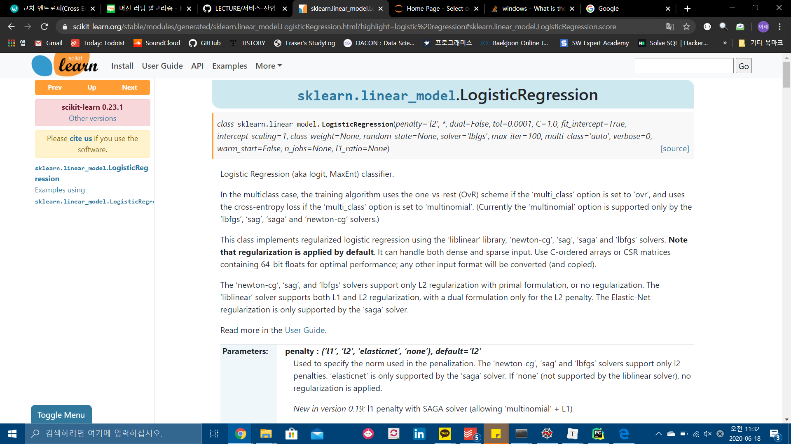
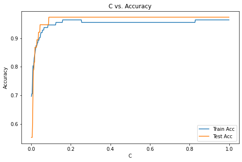

# Cross Entropy와 Loss Function

 원래 loss func로 가장 많이 사용되던 게 MSE. 그런데 분류 문제에서는 이거 이외에 cross entropy를 써도 된다는 이야기를 했다. MSE는 분류, 회귀 등 어디든 적용 가능. CE는 분류 문제에 대해서만 가능.

 MSE를 통해 W, b를 줄이면 최적인 loss func를 찾을 수 있다는 게 수학적으로 증명되어 있다. 그런데 cross entropy는 수학적으로 정교하게 유도된 식이 아니라, Shannon이 정보량으로부터 만들어낸 식. 앞 뒤를 잘 맞추기 위해 로그도 붙이고.


 과연 이걸 써도 추정이 잘 되어서 잘 될까 하는 걸 증명한 부분이 39페이지. CE를 최소화한다는 얘기는 true val과 pred val 두 개가 같아지는 확률을 극대화하는 것과 동일하다는 말. 수학적 증명. CE 써도 된다. 오히려 더 좋다.

 CE 최소화의 문제는 두 개가 같아지는 확률을 극대화하는 것과 동일.


 손으로 계산해보자. 40페이지부터.

 CE  = -y x log y hat

y : 정답에 해당. 


--< 40페이지 보면 CE가 낮거나 MSE가 낮으면 정확도가 높아진다. 일단 여기서 알려고 하는 건, CE 작아지는 폭이 더 크다. 더 빨리 수렴한다. 둘 다 지표로 쓸 수 있따. 


 이진분류 : binary crossentropy, 다중분류 : categorical cross entropy

 클래스가 3개 이상이면 


| 이진 분류<br>(Binary Cross Entropy) | 다중 분류<br/>(Categorical Cross Entropy) |
| :---------------------------------: | :---------------------------------------: |
|            클래스 [0, 1]            |           클래스 [0, 1, 2, ...]           |
|            sigmoid일 때             |               softmax일 때                |
|                                     |                                           |
|                                     |                                           |
|                                     |                                           |
|                                     |                                           |
|                                     |                                           |
|                                     |                                           |
|                                     |                                           |


Q) 명확한 수학적 근거가 있으려고 하는 거였나?????

Q) 다중분류일 때 CE 식 어떻게 되나? 1-yi가 아닌 애들을 다 앞에다가 곱해주나?


https://gombru.github.io/2018/05/23/cross_entropy_loss/


# 손실


*  학습: 학습을 한다는 것은 알고 있는 데이터를 통해 W, b 등의 파라미터를 추정하는 작업. W, b가 추정되었으면 하나의 모델이 완성된 것. 
* 추정/예측 : 새로운 데이터를 모델에 집어 넣으면 output 값이 추정되는 흐름. 


 그렇다면 파라미터를 추정하는 방법이, 추정 방법으로 가장 많이 사용하는 것은? loss function을 정의해 놓고 그것을 최소화하는 방법이 가장 많이 사용됨. DL 가서 거의 이걸 사용

* Loss func 최소화 : 딥러닝 
* Likelihood func 최대화 : 


 사이킷런 로지스틱 리그레션 디폴트는 MLE. multiclassification 같은 경우에만 한정적으로 loss func.


손필기 1)

---


 그러면 MLE 무엇인가 간략하게 개요 정도만 봐보자.


[https://scikit-learn.org/stable/modules/generated/sklearn.linear_model.LogisticRegression.html?highlight=logistic%20regression#sklearn.linear_model.LogisticRegression](https://scikit-learn.org/stable/modules/generated/sklearn.linear_model.LogisticRegression.html?highlight=logistic regression#sklearn.linear_model.LogisticRegression)


---

손필기 2)

1 ~ 500 숫자가 있다고 해보자. 어떤 사람이 의도를 가지고 숫자를 두 개 뽑았다고 하자. 16을 뽑을 수도 있고, 64를 뽑을 수도 있고. 이 데이터를 보고, 이 두 숫자를 뽑은 결과 관찰을 바탕으로 잇 ㅏ람의 의도를 생각해 본다. 가능한 시나리오를 나열해 본다. 이 가능한 시나리오를 확률적 선택으로 나타낸다. 

 우도 함수! 최대화되는 지점.


---

사이킷런 로지스틱


**multi_class***{‘auto’, ‘ovr’, ‘multinomial’}, default=’auto’*

If the option chosen is ‘ovr’, then a binary problem is fit for each label. For ‘multinomial’ the loss minimised is the multinomial loss fit across the entire probability distribution, *even when the data is binary*. ‘multinomial’ is unavailable when solver=’liblinear’. ‘auto’ selects ‘ovr’ if the data is binary, or if solver=’liblinear’, and otherwise selects ‘multinomial’.

*New in version 0.18:* Stochastic Average Gradient descent solver for ‘multinomial’ case.

*Changed in version 0.22:* Default changed from ‘ovr’ to ‘auto’ in 0.22.


# 로지스틱 회귀분석


```
Train Accuracy: 0.7593984962406015
Test Accuracy: 0.8
Model Coefficients: [[-0.00659644  0.16039287  0.78193337  1.35325003 -0.18794583  1.57878005]]
Model Intercept: [0.24238757]
Model Classes: [0. 1.]
Probability of the Class Manual: [0.23819596]
Probability of the Class: [[0.76180404 0.23819596]]
Predicted Class of the Sample Data: [0.]
[Parallel(n_jobs=1)]: Using backend SequentialBackend with 1 concurrent workers.
[Parallel(n_jobs=1)]: Done   1 out of   1 | elapsed:    0.0s finished
```


loss function


---

# regularization


과적합 방지하기 위해 페널티 항을 넣는다. SVM, DT가 특별한 모양. 나머지 딥러닝할 때는 전부 LR loss 형태가 일반적인 format. 

CE를 loss function으로 써도 마찬가지. minimize하는데 

과적합된다? 구불구불해진다는 말이다. (손필기)


47페이지.

제약을 두는 거다 단순히 코스트 펑션 말고도!!!!!


 등고선처럼 그림이 그려진다고 해봐. A를 차장가야 해. 

 w1, w2에 대해서 제곱을 해주니까 원의 방정식이 된다. 이 두 개를 합쳐서 제한조건으로 걸어놓을 때 등고선이 내려가다가 최초로 만나는 지점에서  regularization을 적용한 최적점. 가장 낮은 지점보다는 높은 곳에 위치하지만(에러는 커지지만) w1과 w2의 차이가 과도하게 커지지 않는다. 원의 방정식 제약 형태이기 때문에, 가급적 w1과 w2의 차이가 작아지는 방향으로 간다. 부가적으로는 두 가중치가 같아지는 경향을 보일 수도 있음 

### 릿지!!!!!


A의 경우, 가장 낮아지는 점이기 때문에(그 cost function에서는 최적일 수도 잇지만) 과적합이라서 학습 데이터 설명력은 좋지만 새로운 데이터에 대한 예측력이 낮아질 수도 있따.

 그런데 B의 경우 가장 낮아지는 점은 아니라서 학습 데이터 자체에 대한 설명력은 낮아질 수도 있는데, 새로운 데이터에 대한 설명력은 높다. 이 방식의 경우, C가 커질수록 제약을 크게 주라는 의미. C가 커질수록 원의 반경이 작아진다. 그러면 w1과 w2가 점점 더 가까워지려는 경향을 띠게 되겠지. 분석자가 알아서 잘 조절해야 한다.





 사이킷런에서는 `l2`가 디폴트. 그런데 사이킷런 C가 반대다..ㅠㅠ

 일반적으로 그런 것과 달리, C가 여기서 inverse입니다. 이 말은 무슨 말이냐면, C를 크로스 엔트로피의 겨우 일반적으로는 위에처럼 하지만,(강사님 필기)여기서는 C를 앞의 크로스 엔트로피 비중에 곱한다. 원래 C는 정규화 항에 붙는 경우가 대부분인데, 딥러닝에서는. 사이킷런에서 C는 크로스엔트로피 비중이다.

(필기 사진)


(라소 방식) 다이아몬드 L1

(릿지 방식) 원 L2


잘 쓰지는 않지만 regularization term을 세제곱으로 둘 수도 있음.

그러면 커브가 (필기 사진) 처럼 꺾인다.거의 꼭짓점에서 만난다. 그 말은 가중치 중 하나를 0으로 만들고 싶을 때 이걸 슨다. 


MSE L2를 쓸 때는(46쪽) 람다나 C나 거기다가 정규화항을. CE도 마찬가지고. 그런데 사이킷런 패키지 다큐먼트 공식에서는 C가 일반적으로 이해하는 것과 다르다!


46페이지는 사이킷런 다큐먼트를 유도한 것.


---

44페이지

iris data multiclass 


---


사이킷런에서 모델 빌드할 때 Logistic Regression 써주고, model.fit해서 train data를 넣어 줬다.

그러면 W와 b를 추정하는 과정이 되고

```python
model = LogisticRegression()
model.fit(X_train) # W, b 추정
y_hat = model.predict(X_test) # 예측/추정 : W, b 이용.
y_hat = 1/1+e(-(wx+b)) # 추정. x에 test_X 넣음.
```


멀티노미얼 추정하는 과정

(필기 사진)

그래프 표현. 텐서플로우도 나중에 그래프가  되는데, 그 때는 node에 해당하는 게 operator, edge가 tensor. 그래프 표현으로 내부 동작을 설명하게 된다.

- b: 절편(bias/intercept)




# Multinomial Classification


* OvsR 여러 번 수행

1이 한 번씩 나오는 구조.


* 한 번에 수행

출력으로 튀어나오는 게 1개인 경우가 2진 분류(binary classification : 0아니면 1). 그런데 클래스가 여러 개인 경우는 그림이 어떻게 그려지는가?

iris 데이터의 경우, 실제 여기 달려 있는 꽃의 종류인 클래스가 0, 1, 2의 세 종류가 있다. 이건 binary가 아니라 multinomial classification

위와 같은 그림 O vs R 여러 번 적용하면 멀티 분류 가능. 그런데 굳이 그러지 말고 그림을 한 번에 그려 보자. feature 입력 받아서 출력이 3개가 나오도록 한다. 


총 w 2차원 구조 : 3행 4열짜리 행렬. 이진 분류에서는 w가 벡터. 


 45페이지. sigmoid를 원핫으로 다시 표현하려면 소프트맥스.  세 개의 확률을 다 더한 값이 1이 되도록 조정. 그렇게 만들어주는 활성 함수가 softmax. 밑에서 올라온 값들에 exponential 취하고 각각에 exponential 취한 값을 전부 합하고. 그 합이 1이 되도록 조정할 수 있음.  그러면 그 때 가장 큰 확률에 argmax해서 가장 큰 값을 클래스로 보는데 그게 원핫 방식.


 one hot. 각각이 0에서 1사이 값으로 나오는 구조.

이렇게 변환하면 된다.

binary clf는 출력이 1개인 그림. multi clf는 출력이 여러 개 나오는.


# iris 멀티 클래스 분류


