<sup>출처가 명시되지 않은 모든 자료(이미지 등)는 조성현 강사님 블로그 및 강의 자료 기반.</sup>


[머신러닝-분류]

# 군집 분석


 분류에서는 정답에 해당하는 target class를 알고 있는 상태에서 에러를 최소화하도록 학습한다. 정답을 알고 있기 때문에, 기계에게 정답을 알려 주고 추정치와 에러가 작아지는 방향으로 학습하도록 만든다. **지도학습** 방식이다.

 군집 분석에서는 정답에 해당하는 target class가 없다. **비지도 학습** 방식이다. 정답을 모르고 학습한다. 지도학습과 달리 에러를 측정할 방법이 없다. 정답 자체가 없기 때문에, 태생적으로 에러를 알 수 없다. 에러에 해당하는 대용치를 사용해야 할까 생각해야 한다.


# [1] K-Means Clustering


 K개의 중심점을 찍은 후, 중심점에서 각 점 간 거리의 합이 최소가 되는 중심점의 위치를 찾고, 그 점에서 가까운 점들을 묶는 클러스터링 알고리즘이다.

> 1. k 개의 군집 대표 벡터 (centroids) 를 데이터의 임의의 k 개의 점으로 선택합니다.
> 2. 모든 점에 대하여 가장 가까운 centroid 를 찾아 cluster label 을 부여하고,
> 3. 같은 cluster label 을 지닌 데이터들의 평균 벡터를 구하여 centroid 를 업데이트 합니다.
> 4. Step 2 - 3 의 과정을 label 의 변화가 없을때까지 반복합니다.
>
> *출처: [LOVIT x DATA SCIENCE](https://lovit.github.io/nlp/machine learning/2018/03/19/kmeans_initializer/)*


* 군집화

 두 개의 feature가 있다. target은 없다. 그 데이터를 2차원 공간 상에 뿌린다. 그리고 **1) 원하는 군집의 수를 결정**한다. (*K*에 해당하는 수이다.) 

 위와 같이 2차원 공간에 표현한 모든 데이터(유클리디안 공간의 점으로 나타낸다)를 4개의 군집으로 묶는다고 하자. 이 때 데이터 사이에 *임의의 중점(x 표시)*을 설정(initialize centeroid)한다. 그리고 각 데이터마다 어떤 중점에 가까운지 번호를 쓴다. 그렇게 표시한 번호들에 대해 각 번호별로 묶어서 좌표의 중점을 계산한다. 그렇게 잡은 **2) 임의의 중점을 변경**한다. 

 이렇게 중점을 배정하고 변경하는 과정을 반복한다. 그렇게 하면 중점이 계속해서 이동한다. 중점이 변경되지 않을 때까지 계속한다. 그 결과, **3) 각 중점에 가까운 데이터끼리 군집이 형성**된다. 


* 예측

 새로운 데이터가 들어왔을 때, 어떤 중점에 가까운지 결정한다.

 그렇다면 에러 측정을 어떻게 할 수 있을까? 정답을 모르는 상태이기 때문에, 에러 측정은 *근본적으로* 불가능하다. 그러나 대용치는 있다. 군집화가 잘 되었다면, 중점에서 자기 군집 안에 있는 거리들의 총합이 짧을 것이라 예상할 수 있다. 이 때 군집 내에서 각 중점에서 자기 그룹 안에 있는 데이터와의 거리의 합을 에러의 대용치로 사용한다. 


 알고리즘 원리를 수식으로 이해하면 위와 같다. 

 4개의 데이터가 있고, 랜덤한 중점을 잡는다. 각 데이터에 대해 중점과의 거리를 계산한다. 중점과의 거리의 합은 J이다. 이후 거리를 계산해서 해당 데이터를 더 짧은 거리에 있는 중점에 할당한다. 중점에 할당하는 과정을 r로 표현한다. 1이면 중점에 할당된 것이고, 0이면 할당되지 않은 것이다.


## 1. 오류 측정


### Elbow Method


 위에서 표현한 J라는 식이 일종의 *loss function* 역할을 한다. 중점까지 거리 제곱의 합이 작을수록 좋기 때문에, 그렇게 사용해도 큰 문제는 없다.

 J를 최소화하는 assignment와 할당를 찾아야 한다. 각 변수에 대해 J를 편미분한다. 이후 assign된 좌표(r이 1인 것)를 각 개수로 나눈다. **평균 좌표**를 의미한다. assign된 데이터끼리 평균 좌표를 계산하면, 그것이 *loss function*을 **최소화**하는 과정이라고 이해할 수 있다. 이렇게 평균 좌표로 중점을 이동시켜 나간다.

  이렇게 에러를 측정하는 것이 Elbow Method의 기본 원리이다.  초기 중점이 떨어져 있는 경우, 에러가 작을 가능성이 크다. 또한, 클러스터 개수가 증가할 수록 총 에러는 줄어든다. 중점을 많이 잡아 놓으면 거리 총합이 작아지는 것은 당연하기 때문이다.

 클러스터의 개수(k)와 Elbow method로 측정한 SSE의 관계를 그래프로 나타내면 아래와 같다.


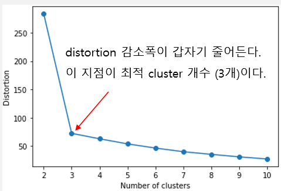


 군집의 개수가 증가할수록 총 에러는 감소하지만, 에러 감소 폭도 작아진다. 따라서 K가 증가할 때 SSE가 줄어드는 폭이 갑자기 작아지는 지점의 군집의 개수(k) 값을 최적 클러스터 개수로 본다.


### 실루엣 계수


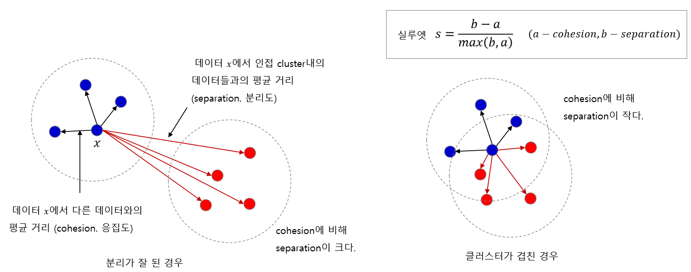


 임의의 점에서 다른 데이터와의 거리를 구한다. 이것을 **응집도(cohesion)**라고 한다. 그리고 제일 인접한 다른 군집 내에 속한 달느 데이터와의 거리를 계산한 거리를 **분리도(separation)**라고 한다.

 이 때 응집도가 분리도보다 작다면, 분리가 잘 되어 있다고 볼 수 있다. 만약 클러스터링이 제대로 되지 않아 군집이 겹친다면, 응집도와 분리도가 별로 차이가 나지 않을 것이다. 이 개념을 통해 응집도와 분리도 간의 차이를 이용한 실루엣 계수를 고안하고, 실루엣 계수가 1에 가까울수록(클수록) 군집화가 잘 되어 있다고 평가한다.


## 2. KMeans++ 알고리즘


 이렇게 중점을 잡는 게 KMeans 알고리즘의 핵심이다. 그러나 그 초기 중점이 제대로 설정되지 않으면 결과가 불안정해지기도 한다. 특히 초기 중점이 고루 선택되지 않고 한 쪽으로 쏠리게 된다면, local optima 문제가 발생한다고 알려져 있다.

 이와 같은 local optima 문제를 완화하기 위해서는 가급적 초기에 설정하는 중점들이 멀리 떨어져 있어야 한다. 그래서 가능한 한 초기 중점을 멀리 잡을 수 있도록 고안된 알고리즘이 **KMeans++** 알고리즘이다.  


 KMeans++ 알고리즘은 1) 임의의 데이터를 선택해서 최초의 중점으로 설정하고, 2) 최초의 중점에서 다른 데이터까지의 거리를 계산헤서 거리에 대한 확률 분포를 만든 후, 3) 확률분포에서 1개를 샘플링해서 다음 중점으로 설정한다.


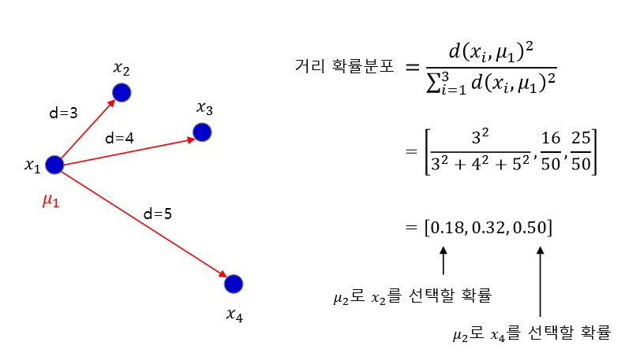


 상세한 과정을 설명하면 다음과 같다.

 데이터가 4개 있다고 가정하자. 첫 중점을 임의의 중점으로 설정한다.  위의 사진에서는 뮤1이 된다. 이제 두 번째 중점으로 선택할 뮤2를 골라야 한다.

 가급적 거리가 가장 먼 것을 선택하는 무조건 거리가 제일 먼 지점을 선택하는 것이 아니라, 3, 4, 5로 도출된 각 거리의 확률분포를 계산한다. 확률분포의 의미를 해석하자면, 두 번째 중점으로 `x2`를 선택할 확률, `x3`를 선택할 확률, `x4`를 선택할 확률이다. 

 이렇게 도출된 [0.18, 0.32, 0.50]의 확률분포에서 하나를 뽑는다. 확률 분포가 다항분포의 형태이기 때문에, 다음의 중점으로 x2, x3, x4가 선택될 확률은 각각 `multinomial` 분포를 따른다. 파이썬 코드로 확인하면 다음과 같다.

```python
for i in range(10):
    u = np.random.multinomial(1, [0.18, 0.32, 0.50])
    centeroid = np.argmax(u)
```

 <center><sup>위의 코드는 머신러닝에서 샘플링을 위해 가장 자주 사용하는 방법이기도 하다.</sup></center>


## 3. 사람의 패턴 인식과의 차이


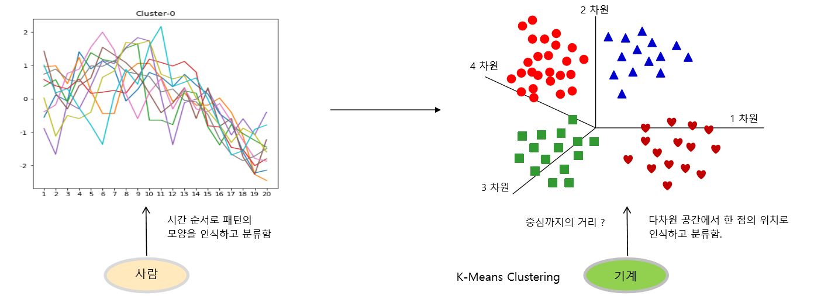


 사람은 패턴의 모양을 인식하고, 모양별로 패턴을 분류한다. 그러나 기계는 모양을 인식하지 않는다. 공간 상의 거리를 측정하여 판단한다. 다차원 공간 상에 벡터를 표시하고, 벡터 간 거리를 측정하여 패턴을 인식하는 것이다.

 예컨대 강아지, 고양이 그림이 있다고 해보자. 사이즈가 28x28이라면, 28x28 = 784차원의 공간에 이미지 전체를 하나의 점으로 표시한다. 강아지는 그 벡터 공간에서 강아지 그림들이 모여 있는 부분을 보고 '이건 강아지 그림이구나!', 고양이는 고양이 그림들이 모여 있는 부분을 보고 '이건 고양이 그림이구나!'하고 인식한다.

 이후 자연어 처리에서 벡터 공간에 자연어를 임베딩한다. 그렇게 된다면, 단어들의 공간에 비슷하게 매핑되는 게 있을 것이다. 아이디어만 가져 가자. 


### 실습 1. blobs

> [사이킷런 KMeans doc](https://scikit-learn.org/stable/modules/generated/sklearn.cluster.KMeans.html)


|                         원래 데이터                          |                         군집화 결과                          |
| :----------------------------------------------------------: | :----------------------------------------------------------: |
| 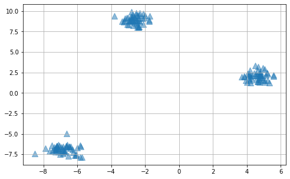 |  |


* `make_blob` : 아무 점이나 임의의 데이터를 찍어 준다.

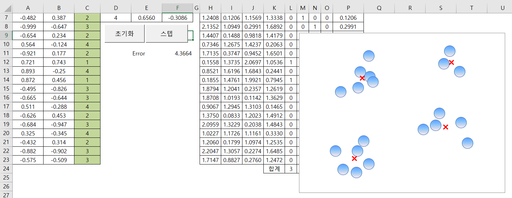


* `n_init` : 초기 중점을 몇 번 설정할 것인지를 나타내는 파라미터. 위의 그림에서 x를 설정하는 것이다. 최상의 결과를 만드는 중심 포인트를 찾아 준다. 거리 중점의 합이 가장 작은 지점을 최종 결과로 채택함으로써, `local minimum` 현상에 빠지는 것을 방지한다. 
* `max_iter` : 설정한 초기 중점을 몇 번의 스텝까지 돌리면서 움직일 것인지. 위의 그림에서 x 표시가 움직이는 것으로 보면 된다.

> 참고
>
> https://stackoverflow.com/questions/40895697/sklearn-kmeans-parameter-confusion
>
> https://stackoverflow.com/questions/46359490/python-scikit-learn-k-means-what-does-the-parameter-n-init-actually-do
>
> https://stats.stackexchange.com/questions/246061/what-are-the-advantages-of-the-pre-defined-initial-centroids-in-clustering


* 학습 과정 기록

```python
done sorting
end inner loop
Iteration 0, inertia 5328.241715548619
start iteration
done sorting
end inner loop
Iteration 1, inertia 5328.050437310368
start iteration
done sorting
end inner loop
Iteration 2, inertia 5327.9612130312
center shift 9.303450e-04 within tolerance 3.240563e-03
Initialization complete
start iteration
done sorting
end inner loop
...
Iteration 0, inertia 70.90016871812779
start iteration
done sorting
end inner loop
Iteration 1, inertia 70.90016871812779
center shift 0.000000e+00 within tolerance 3.240563e-03
```

* `inertia` : 군집화 후,  각 중심점에서 군집 내 각 데이터 간의 거리를 합산한 거리.
* `cluser_centers_` : 클러스터별 중심점 저장.

```python
Centeroids: [[-2.60533164  8.95858242]
 [-6.81681154 -6.88477917]
 [ 4.6119778   2.05815704]]
km inertia: 70.90016871812779
```


### 실습2. Elbow Method

* 데이터 생성

```python
X_data, y_data = make_blobs(n_samples=200, n_features=2, centers=4, cluster_std=0.5, shuffle=True, random_state=42)
```

|                         원래 데이터                          |                            Elbow                             |
| :----------------------------------------------------------: | :----------------------------------------------------------: |
| 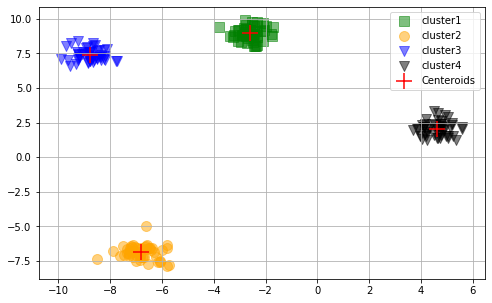 |  |


### 실습 3. Silhouette Method

|                 |                            k = 2                             |                            k = 3                             |                            k = 4                             |
| :-------------: | :----------------------------------------------------------: | :----------------------------------------------------------: | :----------------------------------------------------------: |
|      군집       | 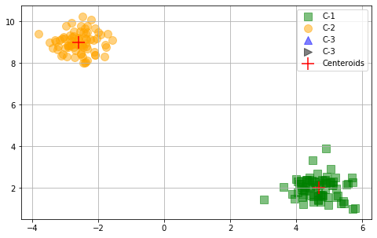 | 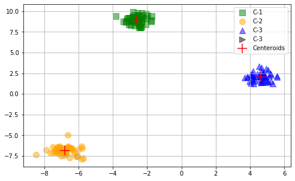 | 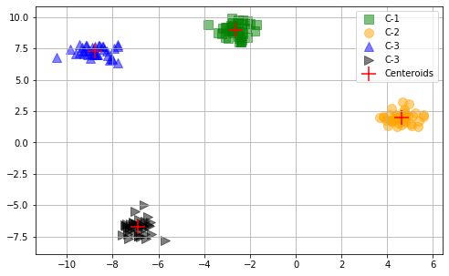 |
| 실루엣 <br>계수 | 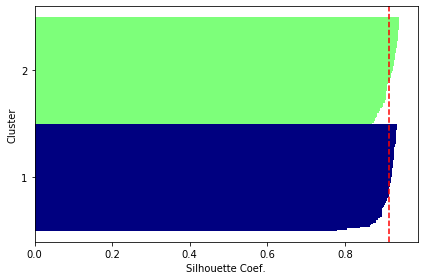 |  | 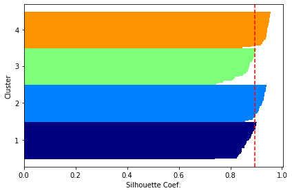 |

  군집의 개수에 따라 실루엣 계수가 모두 다르게 형성될 것이다. 빨간 선을 실루엣 계수의 평균이라고 이해하고, 어느 위치에 있는지 정도로만 해석하고 넘어가자. *~~강사님이 생각하기에 이해하기 좋은 그림은 아닌 것 같다고 하신다~~*


### 실습 4. KMeans++

* `init = 'kmeans++'`
* local minimum 문제에 빠질 가능성이 줄어들기 때문에, 초기 `n_init`을 이전보다 줄여도 된다.


### 실습5. MNIST

* 타겟 데이터를 쓰지 않는다.

* 이미지 데이터 가지고 알아서 군집화하도록 만든다.

* standard scaling 과정이 필요하다. 그냥 적용하면 행 방향으로 표준화하므로(각 픽셀별로 피쳐에 따라 표준화), 각 데이터 내에서 표준화하기 위해 transpose한 후 `StandardScaler`를 적용한다. 이후 원래 데이터 형태처럼 784차원으로 만들기 위해 다시 transpose한다.

* 성능이 잘 안 나와서 PCA를 통한 차원 축소 과정을 거쳤다. 사실 실제 MNIST 데이터는 784차원이므로, feature가 너무 많다. rbf 커널을 활용한 `KernelPCA` 함수를 활용한다.

* `n_clusters = 10`, `init='k-means++'`, `n_init=3` : 초기 중점 설정 과정을 3번 한다. 근데 그 안에서 iteration 최댓값은 300이다. 

  

  ```python
  start iteration
  done sorting
  end inner loop
  Iteration 0, inertia 1343.296497301901
  start iteration
  done sorting
  end inner loop
  Iteration 1, inertia 1270.8136065871927
  start iteration
  done sorting
  end inner loop
  ...
   Iteration 50, inertia 1184.9867461721647
  start iteration
  done sorting
  end inner loop
  Iteration 51, inertia 1184.9867461721647
  center shift 0.000000e+00 within tolerance 7.183667e-07
  
  ```


 분류된 결과가 대체적으로 잘 맞아 떨어지는지 확인해 보자. 클러스터가 숫자 번호를 의미하는 것이 절대 아니므로, 주의하자.

| 클러스터 |                             그림                             |
| :------: | :----------------------------------------------------------: |
|    0     | 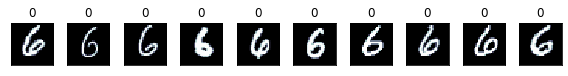 |
|    1     | 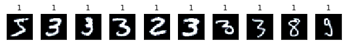 |
|    2     | 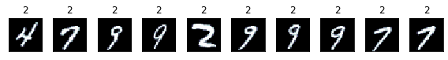 |
|    3     | 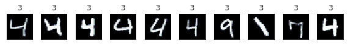 |
|    4     |  |
|    5     | 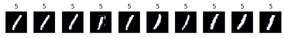 |
|    6     | 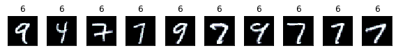 |
|    7     | 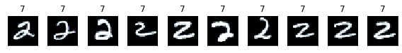 |
|    8     | 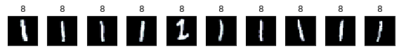 |
|    9     | 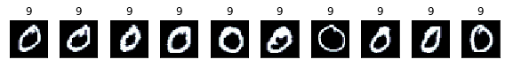 |


### 실습6. 주가 패턴 

* 데이터 확인 : 주가와 과거 20일 패턴. 표준화된 형태.

|                             설명                             |                           raw data                           |
| :----------------------------------------------------------: | :----------------------------------------------------------: |
| 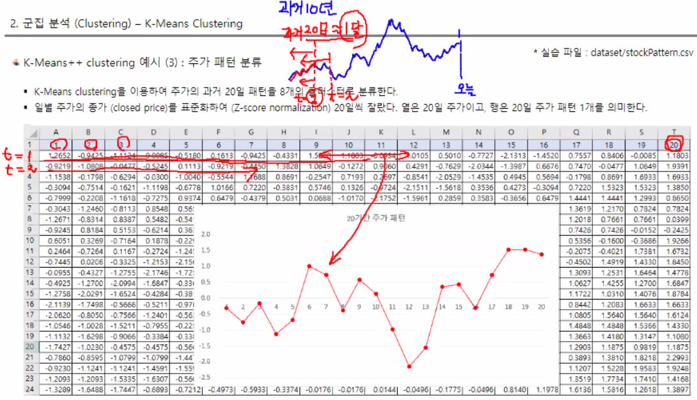 | 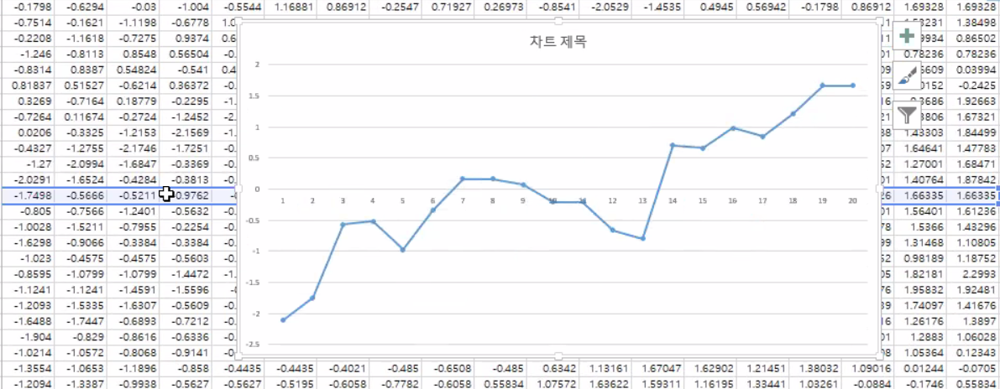 |


* 문제 : 주가 패턴(모양)을 8개의 집단으로 클러스터링한다.

* 강사님 코드 변형 : 함수 만들고, 최적 클러스터 개수 찾는 부분 추가.

  ```python
  def plot_stock_clusters(num_of_clusters, data):
      print(f"Clustering into {num_of_clusters} groups, Start.")
      
      # cluster
      km = KMeans(n_clusters=num_of_clusters, init='k-means++', n_init=30, verbose=1, random_state=42)
      km = km.fit(X)
      y = km.predict(X)
      
      # plot
      fig = plt.figure(figsize=(10, 6))
      colors = 'bgrcmykw'
      centeroids = km.cluster_centers_
      
      for i in range(num_of_clusters):
          s = f"pattern {i}"
          p = fig.add_subplot(2, (num_of_clusters+1)//2, i+1) # 2행 k열로 구성
          p.plot(centeroids[i], 'b-o', markersize=3, color=colors[np.random.randint(0, 7)], linewidth=1.0)
          p.set_title(s)
          
      plt.tight_layout()
      plt.show()
      
      print(f"Clustering into {num_of_clusters} groups, Done.")
      return y, km.inertia_
  ```

  ```python
  # find optimal value: Elbow method 
  distortions = []
  for k in range(2, 13):
      y_km, inertia = plot_stock_clusters(k, X)
      distortions.append(inertia)
  
  plt.plot(range(2, 13), distortions, marker='^')
  plt.xlabel('Num. of Clusters')
  plt.ylabel('Distortions(SSE)')
  plt.title('Finding the Optimal Num. of Clusters', fontdict={'fontsize':18})
  plt.show()
  ```

  

* 시각화 : 주가 중심 패턴의 좌표가 20차원의 벡터로 나온다. 20차원 공간 상에서의 점을 2차원 상의 패턴으로 나타낸다. 대표 패턴이라고 말할 수 있다. Elbow Method를 통해 최적의 클러스터 개수를 찾은 결과 4개 정도가 적당하다. 4개의 클러스터로 구성하여 시각화한다.

|                         Elbow Method                         |                             패턴                             |
| :----------------------------------------------------------: | :----------------------------------------------------------: |
| 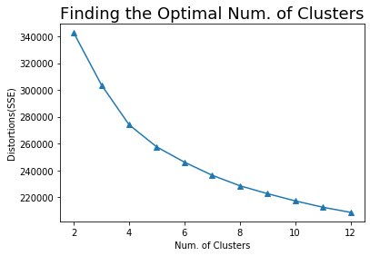<br> k = 4 | 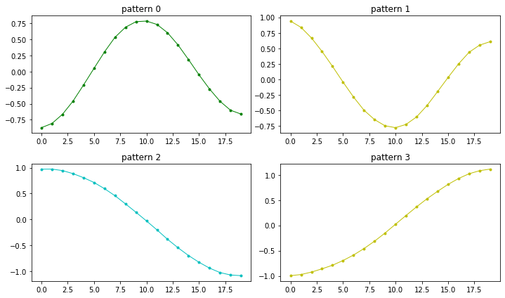 |


* 결과 : 각 클러스터에 어떤 그래프 모양이 모여 있는지 확인한다.

* 해석 및 발전

  * 이 대표 패턴에 해당하는 유형의 날이 며칠 있을까? 첫 번째 데이터의 유형은 중심 패턴 1에 해당한다, 둘째 애들은 클래스 3에 해당한다 이런 식으로 표현할 수 있다. 지나온 과거의 클래스가 1번이다, 2번이다 이런 식으로 해석한다. 레이블을 달 수 있다.
  * 레이블을 붙여 보면, 시계열 데이터를 클래스의 시퀀스로도 표시할 수 있다. 0 다음에 3이 나왔고, 2가 나왔고 등. 그러면 어떠한 패턴이 나오는지 0 3 2 3 5, 3 2 3 5 7 등 레이블만 모아서 레이블에 해당하는 데이터를 구성할 수 있다. 그러면 어떤 패턴 뒤에 어떤 패턴이 이어지는구나 라는 것을 알 수 있다. 이렇게 학습이 완료된 다음, 오늘까지의 시퀀스를 넣어 주면 무엇이 나올지 *이론적으로는* 예측이 가능하다. 이후 지도 학습을 바탕으로 패턴을 예측해 보자.
  
  
  

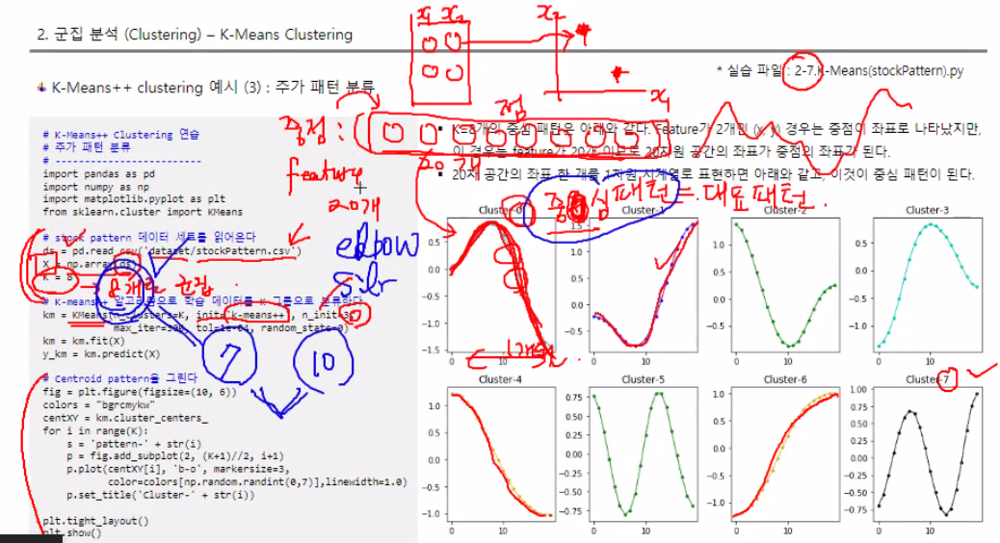

  <center><sup> ㅎㄷㄷ... 역시 사람은 배워야 한다. </sup></center>


---


# [2] HCluster


 각 데이터 포인트 간 거리를 구하고, 거리가 가장 유사한(보통 각 데이터 간 거리가 가장 짧은 것을 기준으로 삼는다) 군집의 한 쌍을 찾아 계층적으로 묶어 나간다.


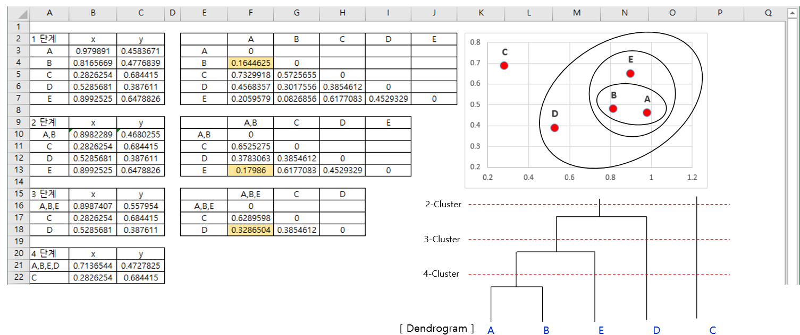


 위와 같이 2개의 feature로 되어 있는 A, B, C, D, E 5개의 데이터 포인트가 있다고 가정하자. 각 데이터를 2차원 유클리드 공간 상의 점으로 각각 표현해서, 거리를 기록한다. 그 중에서 가장 거리가 짧은 데이터를 묶는다. 위의 예에서는 A, B 사이의 거리가 가장 짧기 때문에 A, B를 하나로 묶고, 그 두 점의 평균 좌표를 AB 묶음의 좌표라고 보는 것이다.

 이 과정을 반복하며 공간 상의 여러 점들을 군집으로 묶어 나간다. 각 점 간의 거리를 나타낸 행렬은 어차피 계층 행렬이 될 것이기 때문에, 위쪽이나 아래쪽 한 쪽만 보면 된다. 

 이렇게 계층적으로 묶어 나가는 과정을 표현한 그림이 오른쪽의 dendrogram이다. 여기서 선택하는 점이 점에 따라 만나는 점의 개수가 달라진다. 클러스터의 개수가 되는 것이다.

 참고로, 각 데이터 간 거리를 측정해서 연결하는 방법에는 최단 연결법, 최장 연결법, 평균 연결법, 중심 연결법, 와드 연결법 등이 있다.


### 실습1. 

* Scikit-learn에서도 동일한 기능을 하는 함수가 있지만, 여기서는 Scipy 패키지를 이용했다. 


---


# [3] DBSCAN


 밀집도 기반의 군집 알고리즘이다. 밀집도를 계산하기 위한 핵심 개념은 다음과 같다.

* minimum points
* core point, border point, noise point


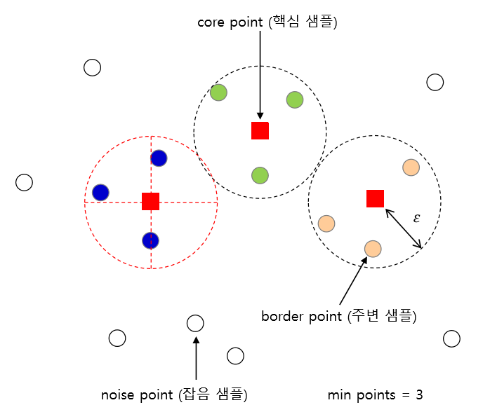


 **밀집도**는 특정 반경 epsilon 안에 있는 데이터 포인트의 개수로 정의된다. 이 때, 반경 epsilon 안에 *최소한* 이 정도의 데이터는 있어야 한다는 기준을 세운다. 그것이 `min points`이다. 

 모든 데이터에 대해 반경 epsilon 안에 있는 데이터 포인트의 개수를 계산한다. 개수를 카운트한 결과가 사전에 정의한 `min points` 이상일 때, 해당 데이터는 **핵심 데이터(core point)**로 정의된다. 

 만약 epsilon 반경 내의 데이터 개수가 `min points`보다 작다면, **경계 데이터(border point)**나, **잡음 데이터(noise point)**로 분류된다. 둘을 나누는 기준은 반경 내에 *핵심 데이터가 존재하는지* 의 여부이다. 비록 epsilon 반경 내의 데이터 개수가 미리 설정한 기준보다 작을지라도, 반경 안에 핵심 데이터가 들어 있다면 해당 데이터는 border point가 된다. 반면, 핵심 데이터도 없고, 반경 내 데이터 개수가 기준도 충족하지 못한다면, 잡음 데이터가 되는 것이다.

 이렇게 모든 데이터 포인트들을 핵심, 경계, 잡음 데이터로 마킹하고 난 뒤, 핵심 데이터 포인트에 연결된 데이터들을 하나의 군집으로 설정한다.


 거리를 기반으로 군집을 설정하게 되면 모든 샘플이 클러스터 내에 묶이기 때문에, 동일한 클러스터 내에 존재하는 샘플이어도 잡음인지 아닌지 구분하기 어렵다는 문제가 있다. 반면, DBSCAN 군집화 알고리즘의 경우, **모든 샘플을 클러스터에 할당하지 않고도** *잡음 샘플을 구별* 할 수 있다. 그래서 아웃라이어를 검출하는 시스템에 사용하기도 한다.


### 실습1. make_moons

 거리 계산 기반 클러스터링 기법과 어떻게 달라지는지를 위주로 파악하자. 각 클러스터링 기법의 차이를 위주로 본다.


* `make_moons` : 달 모양의 점들의 좌표를 생성해 준다. 반환값인 X는 각 점의 좌표들, y는 어떤 종류의 달에 속하는지를 나타낸다.

```python
[[-1.02069027  0.10551754] # 라벨 0 : 위쪽 달
 [ 0.9058265   0.45785751] # 라벨 0
 [ 0.61842175  0.75708632] # 라벨 0
...] 
```


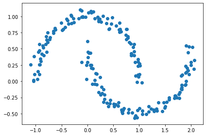

<center><sup>n_sample = 200, noise = 0.05</sup></center>

* `AgglomerativeClustering` : 사이킷런에서 hcluster 구현.
* 결과 비교

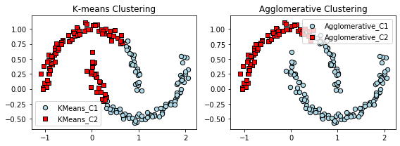

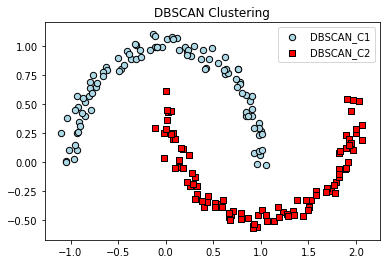


 데이터에 따라 적합한 클러스터링 방식이 다르다.


### 실험 : MNIST

 MNIST 데이터셋 5000개를 DBSCAN으로 분류해 보자. 어떻게 될지는 아무도 안 해봐서 모른다. KMeans와 다른 결과가 나올 수 있을지 찾아내 보자.

 `StandardScaler`로 표준화했고, 클러스터링된 데이터의 라벨이 어떻게 되는지 알아보기 위해 다음의 함수를 만들어 적용했다.

```python
# DBSCAN cluster
def clusterDBSCAN(eps, min_samples, data):
    db_model = DBSCAN(eps=eps, min_samples=min_samples) # DBSCAN model
    db_pred = db_model.fit_predict(data) # DBSCAN result
    return db_model.labels_, db_pred
```


* PCA 적용 안 한 시도

  * 시도 1: eps만 0.1에서 1.0까지 0.1 간격으로 바꿔 줬다. 전부 다 noise 데이터로 분류된다.
  * 시도 2: eps는 0.1로 고정한 채 min_samples만 2에서 14까지 조정해 봤다. 전부 다 noise 데이터로 분류된다.
  * 시도 3: eps를 0.1에서 1.0까지 0.1 간격으로 바꿔 보고, 각각의 경우에 min_samples를 2에서 50까지 조정해 본다.

  

* PCA 적용한 후 시도: 나주에 다시 적용한 후 생각해 본다.


---


# 배운 점, 더 생각해볼 점

* 지난 댓글 NLP 프로젝트에서 커뮤니티 댓글 데이터셋 라벨링할 때, 점수로 계산하는 알고리즘 말고 임베딩된 패턴을 바탕으로 3개의 패턴으로 군집화하는 건 어땠을까?

  > *강사님 답변*
  >
  >  충분히 가능하다. 그런데 자연어 처리에서는 KMeans 알고리즘보다는 다른 방법을 사용하는 게 더 좋다. 다른 알고리즘을 사용해서 문서 분류 등 작업을 수행하는 게 도움이 된다.

  

* 주가 실습에 관련된 강사님 혜안을 얻어 가자. Unsupervised Learning을 통해 과거 주가 패턴을 클러스터링했고, 클러스터링된 라벨을 바탕으로 또 다른 데이터를 구성해 Supervised Learning하여 미래 예측에 활용할 수 있다. 비지도 학습과 지도 학습이 같이 쓰인, 일종의 하이브리드 Learning이다. 이런 생각을 해야 된다. *~~돈을 번다!~~*

* 패턴을 인식하는 기계와 사람의 인식 차이도 생각해 보자.

* MNIST를 DBSCAN 알고리즘으로 군집화하려고 시도할 때,  테스트 겸 반복문을 돌렸는데, 굉장히 수고스러운 과정이다. `gridsearchCV`로 각 파라미터 변경해 보고, unique label의 수가 11(noise -1, 0~9까지)이 나오면(혹은 좀 더 낮춰서 천천히 문턱을 올려가 보는 것도 좋을 듯하다.) 그림을 그려서 확인해 보는 게 좋을 듯하다.

