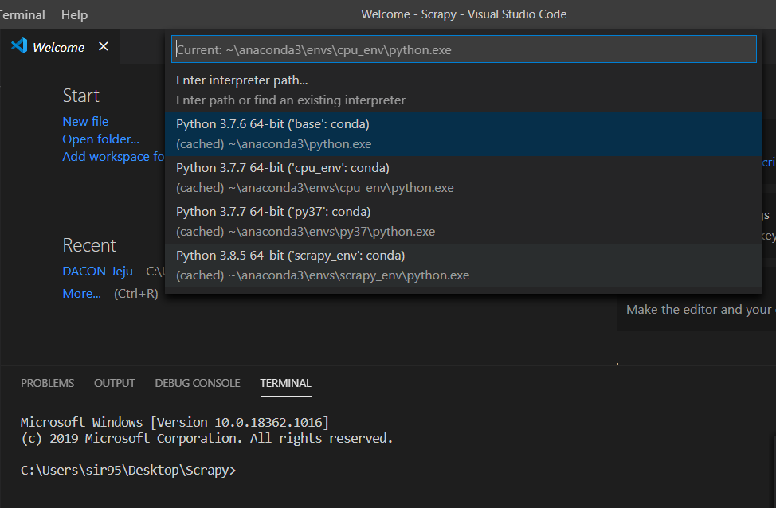
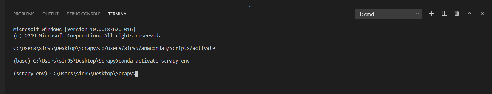

# VSC 환경설정


## 1. 가상환경 설정


* VSC 설치.
* Python 설치.
* Conda 가상환경 설치: `scrapy_env`.


## 2. 가상환경 실행 설정

* 작업할 폴더 생성 및 `Open Folders`로 해당 폴더 이동: `Scrapy`.
* `settings.json` 파일 수정: 경로 잡아줄 것.

```json
{
    "python.pythonPath": "C:\\Users\\sir95\\anaconda3\\envs\\scrapy_env\\python.exe",
    "terminal.integrated.automationShell.windows": "",
    "terminal.integrated.shell.windows": ["C:\\Windows\\System32\\cmd.exe" ], 
    "terminal.integrated.shellArgs.windows": ["/K" , "C:\\Users\\sir95\\anaconda3\\Scripts\\activate.bat C:\\Users\\sir95\\anaconda3 & conda activate scrapy_env"]
}
```

* 터미널 설정 : 윈도우 Commant Prompt
  * `Ctrl` + `Shift` + `P` 
  * `Select Default Shell` : `cmd`
* 인터프리터 선택 : 작업할 가상환경 선택.
  * `Ctrl` + `Shift` + `P`
  * `Select Python Interpreter` : `scrapy_env`.



